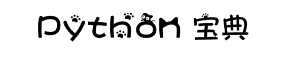

    

---

&ensp;&ensp;&ensp;&ensp; ***简介 :** 一个 Python 全系列的笔记。笔者以一个初学者的立场，用笔记、分享等形式来给大家总结一些东西。总之，Python为基础，让我们向全栈出发！（如果本文有任何问题，欢迎发起 Issues，如果本文帮助了你，欢迎 Star⭐）*

    

---

💌 这里有什么？我将从以下几个方面带你一步一步走向 Python 全栈：

 

📖 **[Step0：Python 脚本](step0-Python-Script)**

    
详情

    <ul>
        <li></li>
    </ul>

📖 **[Step1：Python 基础](step1-Python-basis)**

    
详情

    <ul>
        <li></li>
        <li>正则表达式（Regular Expression, RE）</li>
    </ul>

📖 **[Step2：Pygame 游戏编程](step2-Pygame)**

📖 **[Step3：PyQt5 GUI编程](step3-PyQt5-GUI)**

📖 **[Step4：Python 数据结构与算法](step4-Algorithm)**

📖 **[Step5：Python Web](step5-Python-web)**

    
详情

    <ul>
        <li>（前导知识点：前端 / 计算机网络）</li>
        <li>正则表达式（Regular Expression, RE）</li>
    </ul>

📖 **[Step6：Python 网络爬虫](step6-Crawl)**

📖 **[Step7：数据分析及可视化](step7-Data-Analysis)**

📖 **[Step8：Python 机器学习](step8-Machine-Learning)**

---

    
     
    
迫不及待了吗？赶快戳进我的Python目录主页

    
👉<a href="https://fmw666.github.io/Python/">https://fmw666.github.io/Python/</a>

---

  

    序

