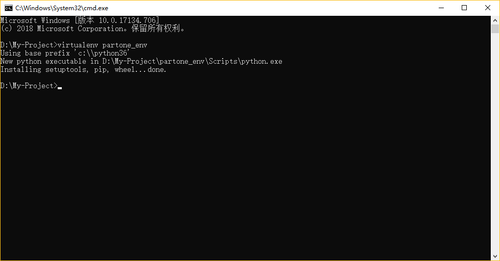

<div align="center">
  <h2><a name="head"></a>📖</h2>
</div>  
<div align="center">
  <strong>⭐第一部分</strong> 
  / 
  <a href="">第二部分</a> 
  / 
  <a href="">第三部分</a> 
  / 
  <a href="#">第四部分</a> 
  / 
  <a href="#">第五部分</a>
</div>

<br>

## *📑章节目录：* 
### [1. 安装Python环境](#1-安装python环境-1)
&emsp;&emsp;[- Windows 操作系统下的安装](#-windows-操作系统下的安装)

&emsp;&emsp;[- 配置 Python 环境变量](#-配置-python-环境变量)

&emsp;&emsp;[- 创建虚拟环境](#-创建虚拟环境)

&emsp;&emsp;[- 虚拟环境的使用及说明](#-虚拟环境的使用及说明)

### [2. 编译器选择](#2-编译器选择-1)
&emsp;&emsp;[- 安装 PyCharm 教程](#-安装-pycharm-教程)

&emsp;&emsp;[- 安装 VS Code 教程](#-安装-vs-code-教程)

### [3. 写出你的第一个Python程序](#3-写出你的第一个Python程序-1)
&emsp;&emsp;- 基于 VS Code 编译器，特此说明

&emsp;&emsp;[- 执行全局的 Python](#-安装-pycharm-教程)

&emsp;&emsp;[- 执行虚拟环境下的 Python](#-安装-pycharm-教程)

<br>.
<br>.
<br>.
<br>.
<br>.
<br>.

<a name="1"></a>
## 1. 安装Python环境

<div align="right"><a href="#章节目录">返回目录⬆</a></div>

### ⚡ Windows 操作系统下的安装
&emsp;---

🐍Python官网下载链接： [https://www.python.org/downloads/](https://www.python.org/downloads/)

- **Python 版本：** 3.7.2

- **下载链接地址：** [点击此处开始下载](https://www.python.org/ftp/python/3.7.2/python-3.7.2-amd64.exe)
+ 下载完成后双击运行安装程序，如图：
  <br><br><br><br>
+ 勾选"Add Python 3.7 to PATH"选项后单击"Customize installation"选项。
  <br><br><br><br>
+ 这里勾选所有选项。其中，
  * ["Documentation"](#welcome) 表示安装Python的帮助文档
  * ["pip"](#welcome) 表示安装Python的第三方包管理工具
  * ["tcl/tk and IDLE"](#welcome) 表示安装Python的集成开发环境
  * ["Python test suite"](#welcome) 表示安装Python的标准测试套件
  * ["py launcher"](#welcome)和["for all users(requirfes elevation)"](#welcome) 表示允许版本更新

  👀勾选完所有选项后，单击"Next"
+ 保持默认勾选状态，单击"Browse"按钮，选择安装路径，然后点击"Install"开始安装。
  <br><br><br><br>

<br>

<div align="right"><a href="#章节目录">返回目录⬆</a></div>

### ⚡ 配置 Python 环境变量
&emsp;---

+ 在命令提示框中(cmd):输入 [`path=%path%;C:\Python`](#welcome)

  > **注意:** [`C:\Python`](#welcome) 是 Python 的安装路径
  <br>
  
#### 🚩[为什么要配置环境变量？](#answer)
  <a name="answer"></a>
  1. 当安装完成 Python 后，你只能在你的安装目录下（含 [`Python.exe`](#welcome) 可执行文件的目录）来执行 Python.exe 或者引用此路径下的 Python.exe 来执行 Python 程序。
  1. 当在计算机中的其他路径下的执行 Python，会出现报错提示"<a href="https://blog.csdn.net/qq_42689684/article/details/82423727" target="_blank">不是内部或外部命令，也不是可运行的程序或批处理文件。</a>"
  1. 如何在电脑全局中使用 Python，就是我们为何要配置环境变量的原因。
  
+ 下面介绍一种更常用的配置环境变量的方法：
  
  * 第一步：鼠标右键"此电脑"，选择"属性"
    <br><br><br><br>
  * 第二步：选择窗口右边"高级系统设置"
    <br><br><br><br>
  * 第三步：选择"环境变量"
    <br><br><br><br>
  * 第四步：在系统变量里，双击"Path"以编辑环境变量
    <br><br><br><br>
  * 第五步：点击右边"新建"，输入Python安装路径，完成环境变量配置。
    <br><br><br><br>
+ 在任意路径处打开CMD窗口，输入`Python`，测试Python是否可以正常运行，输入`exit()`退出运行。
  <br><br><br><br>

<br>

<div align="right"><a href="#章节目录">返回目录⬆</a></div>

### ⚡ 创建虚拟环境
&emsp;---

+ 在命令提示框(cmd)或任意终端中执行下面指令以安装 [python虚拟环境](#welcome)：
  ```python
  pip install virtualenv
  ```

  > **tips:** 可在完成后执行 [`pip list`](#welcome) 来检查是否安装成功，以及执行 [`virtualenv --version`](#welcome) 来查看当前虚拟环境版本。
  <br>

<a name="answer"></a>
#### 🚩[为什么要创建虚拟环境？](#answer1)
  
  1. 虚拟环境是一个虚拟化，从电脑独立开辟出来的环境。通俗的来讲，虚拟环境就是借助虚拟机docker来把一部分内容独立出来，我们把这部分独立出来的东西称作“容器”，在这个容器中，我们可以只安装我们需要的依赖包，各个容器之间互相隔离，互不影响。<sup><a href="#jumpto">[1]</a></sup>
  1. 安装在虚拟环境里的所有包，均不会对环境外的其他包产生影响。反之，在虚拟环境下运行时只能调用虚拟环境中安装的包，不会调用外部的包。
  1. 在很多时候，我们通过 pip 安装的第三方库会有多个版本，而不使用虚拟环境进行隔离，库的版本之间可能会有不兼容情况发生，我们就会遇到无法预期的bug。
  1. 其中 virtualenv 就是创建一个独立的 Python 运行环境（虚拟环境）的工具。
  <br>
  
+ 在安装完 [virtualenv] 后，可在你要创建项目的文件夹下执行：
  ```python
  virtualenv dir_name
  ```
  
  > **注意:** [`dir_name`](#welcome) 是虚拟环境文件夹名
  <br>
  
+ 比如我这里创建一个文件夹名为 [`partone_env`](#welcome) 的虚拟环境目录：
  <br><br><br><br>
  
+ 我们来看一下这个文件夹下有哪些文件？
  ```
  Include        Lib        Scripts        tcl
  ```
  + 暂且不管这些文件都有什么用，但是细心的你也许会发现，这些文件夹在我们安装的 Python 目录下都有，说明我们创建的虚拟环境给我们提供了一个完整的能独立运行 Python 的环境。

  + 除此之外，还有一个 [`pip-selfcheck.json`](#welcome) 文件，它是虚拟环境自我检查的文件，暂不作说明。

  + **说明：** 我们如果用 Python 全局 pip 来安装第三方模块，会安装在 [`C:\Python37\Lib\site-packages`](#welcome) 目录下，但是在虚拟环境下安装，则会安装在 [`partone_env\Lib\site-packages`](#welcome) 目录下。

<br>

<div align="right"><a href="#章节目录">返回目录⬆</a></div>

### ⚡ 虚拟环境的使用及说明
&emsp;---

+ 在你创建好的虚拟环境文件夹下，输入 [`s`](#welcome) 字符，按下键盘 [`tab`](#welcome)，自动补齐 [`Scripts`](#welcome)（如果没有，请检查是否在当前虚拟环境文件夹下），在 [`Scripts`](#welcome) 后面继续输入反斜杠 [`\`](#welcome)，再输入字符 [`a`](#welcome)，按下键盘 [`tab`](#welcome) 键自动补齐 [`Scripts\activate`](#welcome)，然后回车...
  ```
  D:\My-Project\partone-env>Scripts\activate
  ```
  
  > **tips:** 虽然多图片方式会让读者更好的完成指示，但是由于 GitHub 网络代理商原因，访问速度会很慢，图片加载也需要很长时间，所以在非特殊时候，我会尽可能少用图片方式。
  <br>
  
+ 完成回车运行后，我们看一下发生了什么情况。在终端路径前面，多了一个 [（partone_env）](#welcome) （名称为虚拟环境名，所以读者可能与我的不同），这表示我们已进入了当前的虚拟环境。然后执行 [`pip list`](#welcome)，好干净有没有？
  ```
  Package    Version
  ---------- -------
  pip        19.0.3
  setuptools 41.0.0
  wheel      0.33.1
  ```
  
+ 要退出虚拟环境也很简单，同样在虚拟环境文件夹下，输入 [`s`](#welcome) 然后 [`tab`](#welcome)，输入反斜杠 [`\`](#welcome) 再加一个 [`d`](#welcome) 然后 [`tab`](#welcome) 。
  ```
  (partone_env) D:\My-Project\partone_env>Scripts\deactivate.bat
  ```
  
+ 另外，请掌握一个必备的技能 —— 一键导出/入 pip 安装后的包：
  + 在虚拟环境根文件夹下将 pip 安装的所有包/模块导入 [`requirements.txt`](#welcome) 文件：
    ```
    (partone_env) D:\My-Project\partone_env>pip freeze > requirements.txt
    ```
    
    > **tips:** txt 文件前缀可换成任意名，不限定为 requirements，但一般大家都默认为此。注意两点：1. 一定要启用虚拟环境，不然导入的就是全局的 pip 安装过的包。2. 一般都默认在虚拟环境根目录下执行，如果在其他文件夹下执行你在导出时还得去找此 [`requirements.txt`](#welcome) 文件的目录。
  <br>
  
  + 打开 [`requirements.txt`](#welcome) 文件，（如果有内容）我们发现全是我们之前在此虚拟环境下安装过的模块和包。如果没有内容也很正常，说明我们还没在此虚拟环境下安装过第三方模块或包。
  
  + 那么如何导出这个文件？即 [一键安装这个文件下所有的模块/包](#welcome)，很简单，只需要在这个文件对应的目录下执行：
    ```python
    pip install -r requirements.txt
    ```
    
+ 总言之，虚拟环境是个既简单又极其方便的东西。我们后面会将不同的项目建立在不同的虚拟环境下。

---

<div align="right"><a href="#章节目录">返回目录⬆</a></div>

## 2. 编译器选择
+ Python的实际开发中最常用的是 [PyCharm](#welcome) 这款编译器。它带有一整套可以帮助用户在使用 Python 语言开发时提高其效率的工具，比如调试、语法高亮、Project管理、代码跳转、智能提示、自动完成、单元测试、版本控制。此外，该IDE提供了一些高级功能，以用于支持 [Django](#welcome) 框架下的专业 Web 开发。<sup><a>[2]</a></sup>
  > 以上关于 PyCharm 的介绍摘自[百度百科](https://baike.baidu.com/)

+ 但是在当前学习阶段我比较推荐的是 [Visual Studio Code](#welcome)（以下简称 VS code）这款微软的跨平台编译器。因为轻便（但是功能强大），这意味着你打开无需过多等待即能用。而且插件安装方便，对于 [Sublime Text](#welcome) 这种轻便好用，语法高亮的文本编辑器来说，插件安装可以说是傻瓜式的（用过Sublime Text 这种编辑器的才能懂它的插件安装的苦）。

ok，我只介绍这两款软件，下面我会分别给出它们的详细安装教程，以及一些 Python 的相关配置。

<div align="right"><a href="#章节目录">返回目录⬆</a></div>

### ⚡ 安装 PyCharm 教程
&emsp;---

+ PyCharm安装包笔者已提供，[点击我开始下载 PyCharm5.0.3](https://github.com/fmw666/Python/raw/master/step1-Python-basis/files/pycharm5.0.3.zip)

+ 安装 PyCharm 及汉化详细教程见文档 [PyCharm安装教程.md](https://github.com/fmw666/Python/blob/master/step1-Python-basis/PyCharm%E5%AE%89%E8%A3%85%E6%95%99%E7%A8%8B.md#-pycharm503-安装详细教程)

<br>

<div align="right"><a href="#章节目录">返回目录⬆</a></div>

### ⚡ 安装 VS Code 教程
&emsp;---

+ 安装 VS Code 详细教程见文档 [VS-Code安装教程.md](https://github.com/fmw666/Python/blob/master/step1-Python-basis/VS-Code%E5%AE%89%E8%A3%85%E6%95%99%E7%A8%8B.md#-vs-code-安装详细教程)

---

<div align="right"><a href="#章节目录">返回目录⬆</a></div>

## 3. 写出你的第一个Python程序
&emsp;&emsp;首先，我想说，从这一节到最后所有关于Python的基础我都不会着重去讲。打个比方，关于print这个函数就有三个可选参数。如果诸如print函数，其它的函数或者对象方法我也一并全部抛出它们的所有知识点，那么你一定消化不了。或许你是强人，天赋异禀，但相较于平白直抒的抛出知识，我更喜欢寓教于乐的方式。所以一些扩展的语法和知识点我会在<a href="../step2-Pygame" target="_blank">第二部分——Python 游戏编程</a>中去讲述。我觉得学完一个知识点，你能知道它有什么用，为什么会用它，用它能做什么，并且你能实质性的做出什么来，是对你学习记忆最重要的。 

> 这里我选用的编译器是[VS code](#vscode-install)（后面我都会选择用VS code来学习Python）

🐾下面来看VS code来编写和执行Python的过程。
+ 在要存放Python代码的文件夹中右击空白部分，选择"Open with Code"
<br><br><br><br>
+ 打开VS code后在左边你的文件夹下，选择"新建文件"，然后输入Python文件名（注意添加'.py'后缀）
<br><br><br><br>
+ 在建好的Python文件中输入<code>print('Hello World!')</code>，并按下`ctrl + s`保存文件
<br><br><br><br>
+ 在文件内鼠标右击，选择"在终端中运行 Python 文件"
<br><br><br><br>
+ 在下方终端中，能看到Python程序执行后的结果
<br><br><br><br>

---

[返回目录⬆](#快捷目录)
