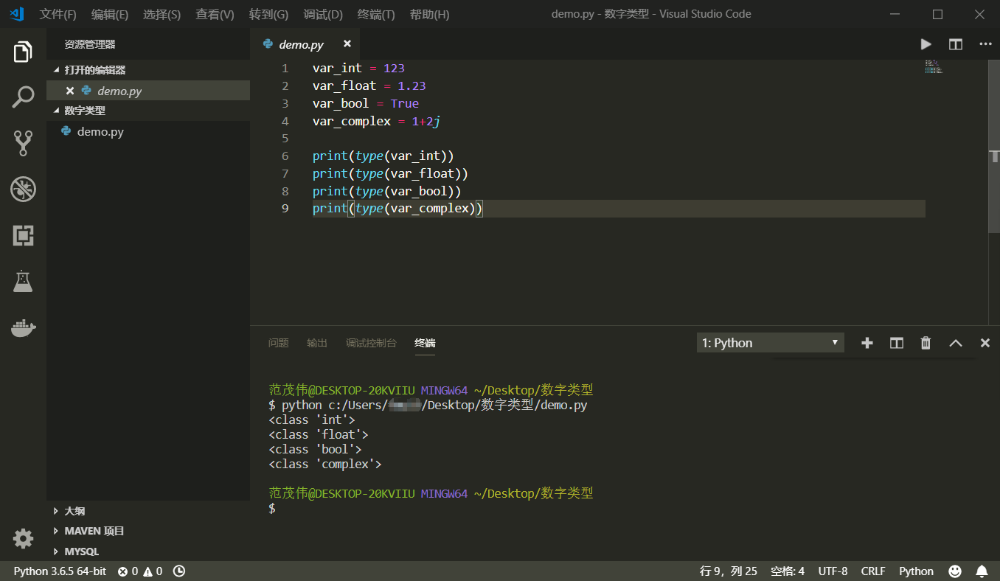
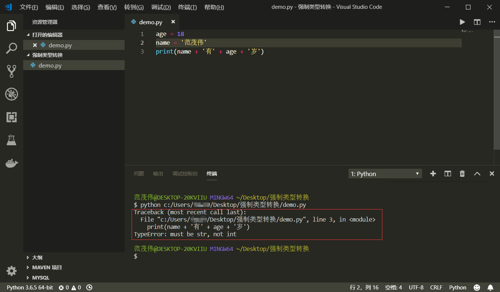

<div align="center">
    <h2><a name="head"></a>📖</h2>
</div>  
<div align="center">
    <a href="Part-One.md#head">第一部分</a> 
    / 
    <strong>⭐第二部分</strong> 
    / 
    <a href="Part-Three.md#head">第三部分</a> 
     / 
    <a href="Part-Four.md#head">第四部分</a> 
    / 
     <a href="Part-Five.md#head">第五部分</a>
</div>

<br>

## *📑章节目录：* 
### [4. Python基本操作](#4)
&emsp;&emsp;[- Python 注释](#-python-注释)

&emsp;&emsp;[- Python 的行与缩进](#-python-的行与缩进)

&emsp;&emsp;[- 多行语句](#-多行语句)

&emsp;&emsp;[- Python 输入与输出](#-python-输入与输出)

&emsp;&emsp;[- Python 变量](#-python-变量)

### [5. Python数据类型](#5)
&emsp;&emsp;[- number (数字)](#-number-数字)

&emsp;&emsp;[- string (字符串)](#-string-字符串)

&emsp;&emsp;[- list (列表)](#-list-列表)

&emsp;&emsp;[- tuple (元组)](#-tuple-元组)

&emsp;&emsp;[- sets (集合)](#-sets-集合)

&emsp;&emsp;[- dictionary (字典)](#-dictionary-字典)

---

.<br>.<br>.

## 4. Python基本操作

<div align="right"><a href="#章节目录">返回目录⬆</a></div>

### ⚡ Python 注释
&emsp;---

+ 注释的目的是让人能轻松阅读每一行代码的意义，同时也为程序员后期代码维护提供了方便。在Python中，一共有两种代码注释，一种是 [单行注释](#welcome)，另一种是 [多行注释](#welcome)。

+ *单行注释以 `#` 号开头：*
    ```python
    # 第一个注释
    print('Hello World') # 第二个注释
    ```

+ *多行注释用两个 `'''` 包含起来:*
  ```python
  '''
  第一行注释
  第二行注释
  '''
  print('Hello World') # '''这样不能注释''' 
  '''这样也能注释'''
  ```

<br>

<div align="right"><a href="#章节目录">返回目录⬆</a></div>

### ⚡ Python 的行与缩进
&emsp;---

+ Python 最具特色的就是使用缩进来表示代码块，即不需要使用大括号。缩进的空格数是可变的，但是同一个代码块的语句必须包含相同的缩进空格数，缩进不一致会导致代码运行错误。

+ *正确示例：*
    ```python
    # 同样缩进四个空格
    if True:
        print('True')
        print('Yes')
    ```

+ *错误示例：*
    ```python
    # 缩进四个空格与三个空格，运行会报错
    if True:
        print('True')
       print('Yes')
    ```

+ *注意，下面这样的代码由于在不同代码块，所以**不会报错** ，但是我们绝不提倡！*
    ```python
    if True:
        print('True')
    else:
       print('False')
    ```

<br>

<div align="right"><a href="#章节目录">返回目录⬆</a></div>

### ⚡ 多行语句
&emsp;---

+ Python 通常是一行写完一条语句，但语句很长的话，可以通过反斜杠'\\'来实现多行语句。
    ```python
    sentence = "让我们以Python为舟，驶向全栈。这一节讲得是Python基础中的\
    多行语句，我们像这样就实现了写一条长句子的麻烦！"
    print(sentence)
    ```
  > 输出结果为："让我们以Python为舟，驶向全栈。这一节讲得是Python基础中的多行语句，我们像这样就实现了写一条长句子的麻烦！"

+ 这里有第二种方法，一般来说适合一段长文本的赋值，比如下面这个例子。
    ```python
    html = """
    <html>
        <head>
            <title>网页标题</title>
        </head>
        <body>
            <div class="container">
                <div class="list">
                    <ul>
                        <li><a herf="#">列表1</a></li>
                        <li><a herf="#">列表2</a></li>
                    </ul>
                </div>
            </div>
        <body>
    </html>
    """
    ```
    

<br>

<div align="right"><a href="#章节目录">返回目录⬆</a></div>

### ⚡ Python 输入与输出
&emsp;---

+ ***Python 中文编码***

    + 如果在运行[Python](#4.4)程序中，出现以下错误提示：
        ```python
        SyntaxError: Non-ASCII character '\xe4' in file test.py on line 2, but no encoding declared; see http://www.python.org/peps/pep-0263.html for details
        ```
    + 则未指定编码，需要在文件开头添加 `#coding=utf-8`

        > 对于 [VS code](#vscode-install)，可以在界面右下角中选择编码 [UTF-8](#no-jump)

+ ***Python 输出***
  
    ```python
    >>>print('hello,world')
    ```
    + [print()](#welcome) 函数可以接受多个字符串（字符串用一对`''`或者`""`表示），用逗号`,`或者加号`+`隔开，不过逗号在输出中相当于空格，加号则直接连接：

        ```python
        >>>print('hello','world')
        hello world
        >>>print('hello'+'world')
        helloworld
        ```
    + [print()](#welcome) 函数可以用于打印常数，或作计算

        ```python
        >>>print(100)
        100
        >>>print(1 + 1.1)
        2.1
        ```

+ ***Python 输入***
  
    ```python
    >>>name = input()
    fmw
    ```
    + 当出现[input()](#input)函数以后，命令行会等待用户输入一串字符，此时用户输入的字符串将保留在[name](#no-jump)变量中。

        ```python
        >>>name
        'fmw'
        >>>print(name)
        fmw
        ```
    + 当然，为了增加用户交互体验，我们可以

        ```python
        >>>name = input('Please input your name:')
        Please input your name:fmw
        >>>print('hello',name)
        hello fmw
        ```

<br>

<div align="right"><a href="#章节目录">返回目录⬆</a></div>

### ⚡ Python 变量
&emsp;---

+ ***变量赋值***
  
    + Python中的赋值很简单，不需要先指明变量的数据类型。看下面代码：

        ```python
        a = 6
        print(a)
        ```
        > **注意：** Python的变量无需提前声明，赋值的同时也就声明了变量。

+ ***变量命名***
  
    + Python中自带关键字（保留字），变量名不能与之相同。变量名由`字母`、`下划线'_'`和`数字`组成，且不能以数字开头。在Python标准库中提供了一个 [keyword](#no-jump)模块，可以查阅当前版本的所有关键字，方法如下：

        ```python
        import keyword
        print(keyword.kwlist)
        ```

        

---

<div align="right"><a href="#章节目录">返回目录⬆</a></div>

## 5. Python数据类型

🐍Python中有六大数据类型：

<div align="center">
    <a href="#-number-数字">number (数字)</a> 
    / 
    <a href="#-string-字符串">string (字符串)</a> 
    / 
    <a href="#-list-列表">list (列表)</a> 
    / 
    <a href="#-tuple-元组">tuple (元组)</a> 
    / 
    <a href="#-sets-集合">sets (集合)</a> 
    / 
    <a href="#-dictionary-字典">dictionary (字典)</a>
</div><br><br>

> **⚡Python3 中可以使用 [type()](#no-jump) 函数来查看变量数据类型！**

<div align="right"><a href="#章节目录">返回目录⬆</a></div>

### ⚡ number (数字)
&emsp;---

+ Python3中支持4种类型的数字：int(整数类型)、float(浮点类型)、bool(布尔类型)、complex(复数类型)
    ```python
    var_int = 123
    var_float = 1.23
    var_bool = True
    var_complex = 1+2j

    print(type(var_int))
    print(type(var_float))
    print(type(var_bool))
    print(type(var_complex))
    ```



<br>

<div align="right"><a href="#章节目录">返回目录⬆</a></div>

### ⚡ string (字符串)
&emsp;---

+ ***字符串的表示***
  
    字符串是单引号、双引号、或者三引号中的内容。其中三引号多用来指示一个[多行字符串](#4.3)，在字符串表示中，要注意引号一定要匹配！
    
    ```python
    str1 = 'fmw666'
    str2 = "fmw666"
    str3 = '''fmw
    666'''
    ```
    
    *值得注意的是，引号内的内容不包含制表符。比如：*
    
    ```python
    >>> print('fmw\n666')
    fmw
    666
    ```
    
    *并且如果引号中的字符串出现了同样的引号，会出现报错，应该借用转义符 \\*
    
    ```python
    >>> print('what\'s your name?')
    what's your name?
    ```
    
    > [提示：](#no-jump)如果要输入一个反斜杠 \，则需要使用 '\\\\' 的形式来表示。
    
    *如果引号内字符串的内容不需要转义，只想输出本来的内容，则在字符串前加上 `r` 或` R` 前缀即可，比如：*
    
    ```python
    >>> print(r'fmw\n666')
    fmw\n666
    ```
    
+ ***字符串的截取***
  
    字符串的截取格式：`[start_index:end_index+1]`，没看懂没关系，下面结合几个例子说明：
    
    ```python
    str = 'fmw666'
    str = 'fmw666'
    print(str[0])     # 输出的结果为'f'
    print(str[-1])    # 输出的结果为'6'
    print(str[3:7])   # 输出的结果为'666'
    '''更多的留给读者自己思考'''
    ```
    
+ ***强制类型转换***
  
    为什么在字符串这里提强制类型转换呢？因为多数时候，我们会用到数字类型向字符类型的转换。尤其在[print()](#print)函数里打印的本质类型就是字符串，包括[input()](#input)函数中读取用户输入后的值为字符串类型。所以我们经常会在以下例子中看到强制类型转换的用处：
    
    ```python
    age = 18
    name = '范茂伟'
    print(name + '有' + str(age) + '岁')
    ```
    
    如果不加`str()`则会出现提醒：
    
    

<br>

<div align="right"><a href="#章节目录">返回目录⬆</a></div>

### ⚡ list (列表)
&emsp;---

+ Python列表是任意对象的有序集合，列表写在中括号 `[]` 中，元素之间用逗号隔开。这里的任意对象，既可以是列表嵌套列表，也可以是字符串等其他数据类型。
  
    ```python
    >>> list = ['python', 123, [1, 2, 3], 3.14, True]
    >>> print(list)
    ['python', 123, [1, 2, 3], 3.14, True]
    ```
  
+ 列表的切片和索引和字符串的方法一样：
  
    ```python
    >>> list = ['python', 123, [1, 2, 3], 3.14, True]
    >>> print(list[2])
    [1, 2, 3]
    >>> print(list[1:3])
    [123, [1, 2, 3]]
    ```

+ 列表内内置很多方法，比如排序[sort()](#no-jump)、倒序[reverse()](#no-jump)等等。（有兴趣和需求自行探索，后续阶段中会再讲解。）

    ```python
    >>> list = ['python', 123, [1, 2, 3], 3.14, True]
    >>> list.reverse()
    >>> print(list)
    [True, 3.14, [1, 2, 3], 123, 'python']
    
    >>> list = [4, 5, 3, 1, 2]
    >>> print(list)
    [4, 5, 3, 1, 2]
    >>> list.sort() 
    >>> print(list)
    [1, 2, 3, 4, 5]
    ```

<br>

<div align="right"><a href="#章节目录">返回目录⬆</a></div>

### ⚡ tuple (元组)
&emsp;---

+ 元组（tuple）与列表类似，不同之处在于元组内的元素不能修改。元组写在小括号 `()` 中，元素之间用逗号隔开。如下面表示所示：
    ```python
    >>> tuple = ('python', 123, [1, 2, 3], 3.14, True)
    ```
  
    > 因为元组内的元素不能被修改，所以它自身就不像列表一样存在很多内置方法，但是它的索引和切片依旧和列表一样，这里就不演示了。
  
+ 元组 [tuple](#welcome) 的陷阱：当你定义一个 [tuple](#welcome) 时，在定义的时候，[tuple](#welcome) 的元素就必须被确定下来，比如：
    
    ```python
    >>> tuple = (1, 2)
    >>> tuple
    (1, 2)
    ```
  
    如果要定义一个空的 [tuple](#welcome)，可以写成 [()](#no-jump) ：
  
    ```python
    >>> tuple = ()
    >>> tuple
    ()
    ```
    
    但是，要定义一个只有1个元素的 [tuple](#welcome)，如果你这么定义：
    
    ```python
    >>> tuple = (1)
    >>> tuple
    1
    ```
    
    定义的不是 [tuple](#welcome)，是1这个数！这是因为括号 () 既可以表示 [tuple](#welcome)，又可以表示数学公式中的小括号，这就产生了歧义，因此，[Python](#no-jump) 规定，这种情况下，按小括号进行计算，计算结果自然是1。

    所以，只有1个元素的 [tuple](#welcome) 定义时必须加一个逗号 '[,](#no-jump)' ，来消除歧义：
    
    ```python
    >>> tuple = (1,)
    >>> tuple
    (1,)
    ```

<br>

<div align="right"><a href="#章节目录">返回目录⬆</a></div>

### ⚡ sets (集合)
&emsp;---

+ 集合(set)是一个无序不重复元素的序列，可以用大括号 [{}](#welcome) 或者 [set()](#welcome) 函数来创建。值得注意的是，如果要创建一个空集，必须使用 [set()](#welcome) 函数来创建，而不能使用大括号 [{}](#welcome) ，因为大括号 [{}](#welcome) 是用来创建空字典(dict)的！
  
    ```python
    >>> set = {1, 3, 2, 4, 2, 2}
    >>> print(set)
    {1, 2, 3, 4}

    >>> a = set()
    >>> print(type(a))
    <class 'set'>
    >>> b = {}
    >>> print(type(b))
    <class 'dict'>
    ```

<br>

<div align="right"><a href="#章节目录">返回目录⬆</a></div>

### ⚡ dictionary (字典)
&emsp;---

+ 字典(dict) 是一个无序的键(key)值(value)对的集合，格式如下所示：

    ```python
    dict = {key1: value1, key2: value2}
    ```
  
+ 字典的创建方法如下：
    
    ```python
    dict = {
        'name': 'fmw',
        'age': 18
    }
    print(dict)         # 输出：{'name': 'fmw', 'age': 18}
    ```
  
+ 字典添加数据和删除数据：
  
    ```python
    dict = {
        'name': 'fmw',
        'age': 18
    }
    dict['sex'] = 'boy'
    print(dict)         # 输出：{'name': 'fmw', 'age': 18, 'sex': 'boy'}
    
    del dict['age']
    print(dict)         # 输出：{'name': 'fmw', 'sex': 'boy'}
    ```

<br>

---

[返回目录⬆](#章节目录)

<br><br>

<div align="center">第二部分 · 完</div>