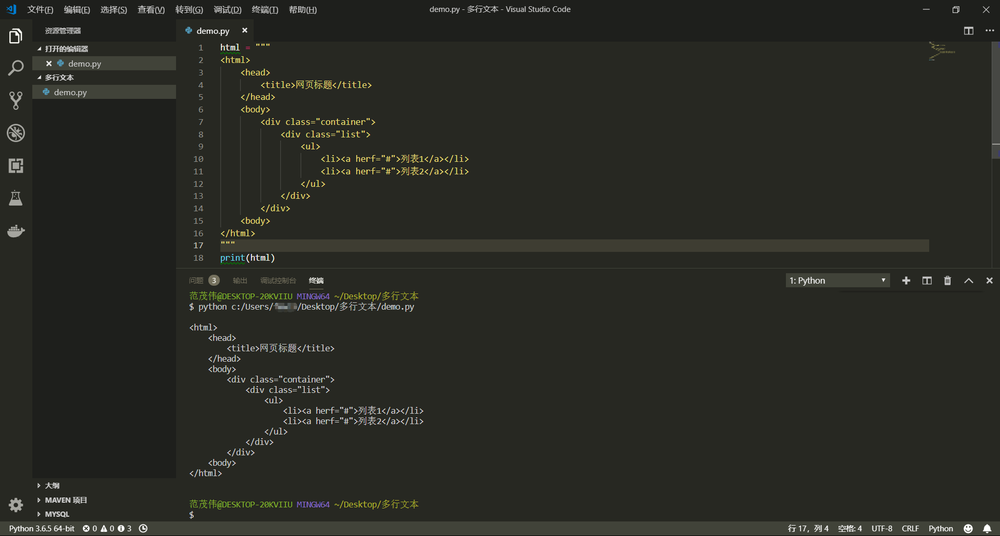
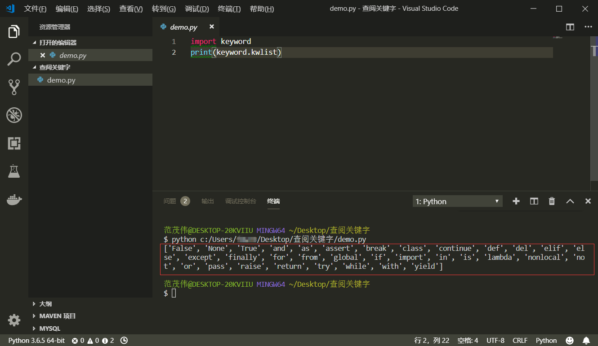

<div align="center">
    <h2><a name="head"></a>📖</h2>
</div>  
<div align="center">
    <a href="Part-One.md#head">第一部分</a> 
    / 
    <strong>⭐第二部分</strong> 
    / 
    <a href="Part-Three.md#head">第三部分</a> 
     / 
    <a href="Part-Four.md#head">第四部分</a> 
    / 
     <a href="Part-Five.md#head">第五部分</a>
</div>

<br>

## *📑章节目录：* 
### [4. Python基本操作](#4)
&emsp;&emsp;[- Python 注释](#-python-注释)

&emsp;&emsp;[- Python 的行与缩进](#4.2)

&emsp;&emsp;[- 多行语句](#4.3)

&emsp;&emsp;[- Python 输入与输出](#4.4)

&emsp;&emsp;[- Python 变量](#4.5)

### [5. Python数据类型](#5)
&emsp;&emsp;[- number (数字)](#5.1)

&emsp;&emsp;[- string (字符串)](#5.2)

&emsp;&emsp;[- list (列表)](#5.3)

&emsp;&emsp;[- tuple (元组)](#5.4)

&emsp;&emsp;[- sets (集合)](#5.5)

&emsp;&emsp;[- dictionary (字典)](#5.6)

---

.<br>.<br>.

## 4. Python基本操作

<div align="right"><a href="#章节目录">返回目录⬆</a></div>

### ⚡ Python 注释
&emsp;---

+ 注释的目的是让人能轻松阅读每一行代码的意义，同时也为程序员后期代码维护提供了方便。在Python中，一共有两种代码注释，一种是 [单行注释](#welcome)，另一种是 [多行注释](#welcome)。

+ *单行注释以 `#` 号开头：*
    ```python
    # 第一个注释
    print('Hello World') # 第二个注释
    ```

+ *多行注释用两个 `'''` 包含起来:*
  ```python
  '''
  第一行注释
  第二行注释
  '''
  print('Hello World') # '''这样不能注释''' 
  '''这样也能注释'''
  ```

<br>

<div align="right"><a href="#章节目录">返回目录⬆</a></div>

### ⚡ Python 的行与缩进
&emsp;---

+ Python 最具特色的就是使用缩进来表示代码块，即不需要使用大括号。缩进的空格数是可变的，但是同一个代码块的语句必须包含相同的缩进空格数，缩进不一致会导致代码运行错误。

+ *正确示例：*
    ```python
    # 同样缩进四个空格
    if True:
        print('True')
        print('Yes')
    ```

+ *错误示例：*
    ```python
    # 缩进四个空格与三个空格，运行会报错
    if True:
        print('True')
        print('Yes')
    ```

+ *注意，下面这样的代码由于在不同代码块，所以**不会报错** ，但是我们绝不提倡！*
    ```python
    if True:
        print('True')
    else:
        print('False')
    ```

<br>

<div align="right"><a href="#章节目录">返回目录⬆</a></div>

### ⚡ 多行语句
&emsp;---

+ Python 通常是一行写完一条语句，但语句很长的话，可以通过反斜杠'\\'来实现多行语句。
    ```python
    sentence = "让我们以Python为舟，驶向全栈。这一节讲得是Python基础中的\
    多行语句，我们像这样就实现了写一条长句子的麻烦！"
    print(sentence)
    ```
  > 输出结果为："让我们以Python为舟，驶向全栈。这一节讲得是Python基础中的多行语句，我们像这样就实现了写一条长句子的麻烦！"

+ 这里有第二种方法，一般来说适合一段长文本的赋值，比如下面这个例子。
    ```python
    html = """
    <html>
        <head>
            <title>网页标题</title>
        </head>
        <body>
            <div class="container">
                <div class="list">
                    <ul>
                        <li><a herf="#">列表1</a></li>
                        <li><a herf="#">列表2</a></li>
                    </ul>
                </div>
            </div>
        <body>
    </html>
    """
    ```
    

<br>

<div align="right"><a href="#章节目录">返回目录⬆</a></div>

### ⚡ Python 输入与输出
&emsp;---

+ ***Python 中文编码***

    + 如果在运行[Python](#4.4)程序中，出现以下错误提示：
        ```python
        SyntaxError: Non-ASCII character '\xe4' in file test.py on line 2, but no encoding declared; see http://www.python.org/peps/pep-0263.html for details
        ```
    + 则未指定编码，需要在文件开头添加 `#coding=utf-8`

        > 对于 [VS code](#vscode-install)，可以在界面右下角中选择编码 [UTF-8](#no-jump)

+ ***Python 输出***
  
    ```python
    >>>print('hello,world')
    ```
    + [print()](#welcome) 函数可以接受多个字符串（字符串用一对`''`或者`""`表示），用逗号`,`或者加号`+`隔开，不过逗号在输出中相当于空格，加号则直接连接：
        ```python
        >>>print('hello','world')
        hello world
        >>>print('hello'+'world')
        helloworld
        ```
    + [print()](#welcome) 函数可以用于打印常数，或作计算
        ```python
        >>>print(100)
        100
        >>>print(1 + 1.1)
        2.1
        ```

+ ***Python 输入***
  
    ```python
    >>>name = input()
    fmw
    ```
    + 当出现[input()](#input)函数以后，命令行会等待用户输入一串字符，此时用户输入的字符串将保留在[name](#no-jump)变量中。
        ```python
        >>>name
        'fmw'
        >>>print(name)
        fmw
        ```
    + 当然，为了增加用户交互体验，我们可以
        ```python
        >>>name = input('Please input your name:')
        Please input your name:fmw
        >>>print('hello',name)
        hello fmw
        ```

<br>

<div align="right"><a href="#章节目录">返回目录⬆</a></div>

### ⚡ Python 变量
&emsp;---

+ ***变量赋值***
  
    + Python中的赋值很简单，不需要先指明变量的数据类型。看下面代码：
        ```python
        a = 6
        print(a)
        ```
        > **注意：** Python的变量无需提前声明，赋值的同时也就声明了变量。

+ ***变量命名***
  
    + Python中自带关键字（保留字），变量名不能与之相同。变量名由`字母`、`下划线'_'`和`数字`组成，且不能以数字开头。在Python标准库中提供了一个 [keyword](#no-jump)模块，可以查阅当前版本的所有关键字，方法如下：
        ```python
        import keyword
        print(keyword.kwlist)
        ```
        

---

<div align="right"><a href="#章节目录">返回目录⬆</a></div>

## 5. Python数据类型

<div align="right"><a href="#章节目录">返回目录⬆</a></div>

### ⚡ number (数字)
&emsp;---

xxx

<br>

<div align="right"><a href="#章节目录">返回目录⬆</a></div>

### ⚡ string (字符串)
&emsp;---

xxx

<br>

<div align="right"><a href="#章节目录">返回目录⬆</a></div>

### ⚡ list (列表)
&emsp;---

xxx

<br>

<div align="right"><a href="#章节目录">返回目录⬆</a></div>

### ⚡ tuple (元组)
&emsp;---

xxx

<br>

<div align="right"><a href="#章节目录">返回目录⬆</a></div>

### ⚡ sets (集合)
&emsp;---

xxx

<br>

<div align="right"><a href="#章节目录">返回目录⬆</a></div>

### ⚡ dictionary (字典)
&emsp;---

xxx

<br>

---

[返回目录⬆](#章节目录)

<br><br>

<div align="center">第二部分 · 完</div>