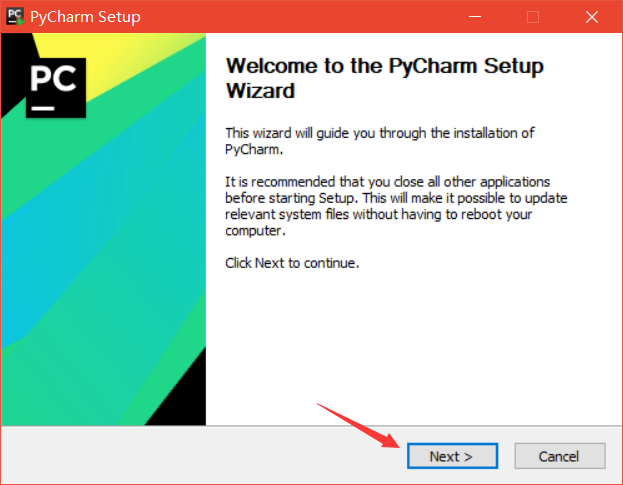
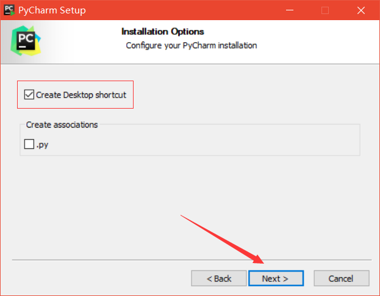
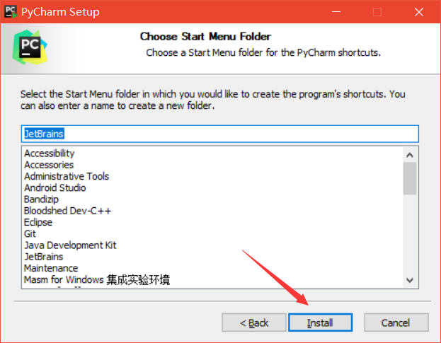
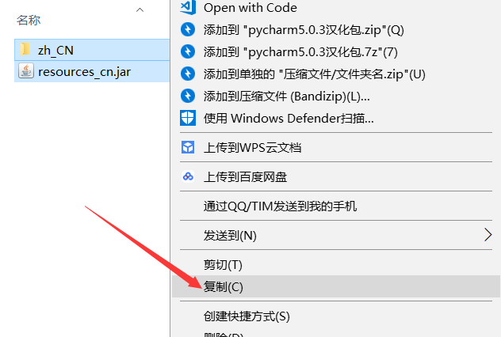
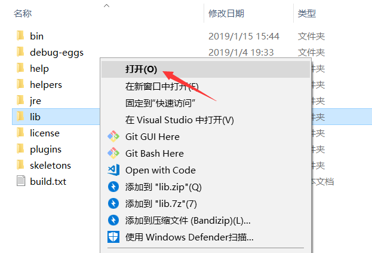
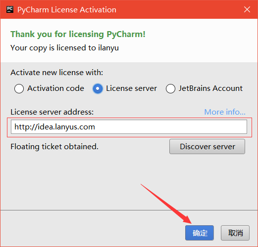
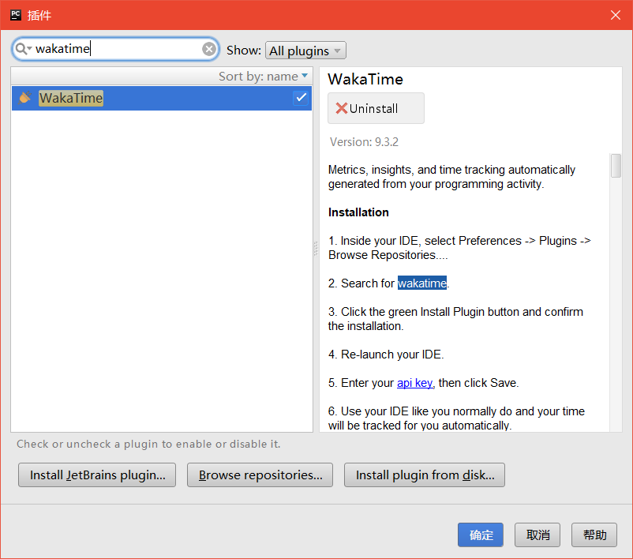
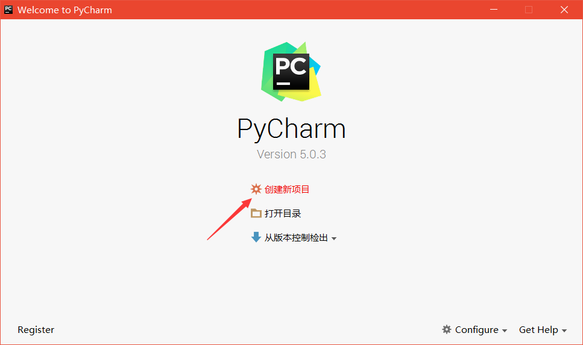

  <h2>⚙ PyCharm5.0.3 安装详细教程</h2>

 

> *tips：因网速原因可能会出现图片加载过慢的情况。*

 .
 .
 .

0. PS：请确保你已经安装了我提供的 [PyCharm5.0.3](https://github.com/fmw666/Python/raw/master/step1-Python-basis/files/pycharm5.0.3.zip) 文件。（若没有，请点击前面文件名开始下载）  
1. 右击软件压缩包选择解压到 pycharm5.0.3\
      
1. 在解压文件夹中找到 pycharm-professional-5.0.3，右击打开
      
1. 点击 Next 按钮
      
1. 点击 Browser 按钮更改安装路径，建议安装到除C盘以外的磁盘，然后单击 Next
      
1. 勾选 Create Desktopshortcut（创建桌面快捷方式），然后点击 Next
      
1. 默认 JetBrains，点击 Install 开始安装
      
1. 等待安装完成
      
1. 点击 Finish 结束（后续工作未完成，先不要勾选 Run PyCharm）
      
1. 在解压文件夹中找到 pycharm5.0.3 汉化包，右击打开
      
1. 选中里面所有的内容，右击复制
      
1. 在你安装 PyCharm5.0.3 的文件夹中找到 lib 文件夹，右击打开
      
1. 选择空白处，右击粘贴
      
1. 在桌面找到 JetBrainsPyCharm5.0.3，右击打开
      
1. 这一步中，勾选 License server，在 License server address：处填入 `http：//idea.lanyus.com`,点击确定
      
  
---

1. 安装完成，后面为配置 wakatime 插件步骤。在下方 `Configure` 中选择'插件'
      
1. 输入 [wakatime](https://wakatime.com/)，点击安装
      
1. 在页面中创建新项目，或者打开目录
      
1. 在菜单栏中找到'工具'下方的 `WakaTime Settings`
      
1. 输入 [wakatime](https://wakatime.com/) 官网中你的 API key，点击 'Save'
      
1. 下面开始你愉快的 Python 学习之旅吧~
