# 💬Python 基础
&emsp;&emsp;欢迎来到Python学习的第一部分—— Python基础学习。要知道，任何一门语言没有前期基础的建立，后期的学习都是不牢固的，所以基础这一部分就显得尤为重要。但是呢，为保证我们快速进入到后面学习中，在基础这一部分，语法我不会讲得过于深奥，重要的语法扩展我们留到后面的学习中遇到再展开学习。

---

#### *📑快捷目录：* 
[1. 安装Python环境](#1)

[2. 编译器选择](#2)

&emsp;&emsp;[- 安装PyCharm教程](#pycharm-install)

&emsp;&emsp;[- 安装VS code教程](#vscode-install)

[3. 写出你的第一个Python程序](#3)

[4. Python基本操作](#4)

&emsp;&emsp;[4.1. Python注释](#4.1)

&emsp;&emsp;[4.2. Python 的行与缩进](#4.2)

&emsp;&emsp;[4.3. 多行语句](#4.3)

&emsp;&emsp;[4.4. Python 输入与输出](#4.4)

&emsp;&emsp;[4.5. Python 变量](#4.5)

[5. Python数据类型](#5)

---

<a name="1"></a>
## 1. 安装Python环境
🐍Python官网下载链接：<a href="https://www.python.org/downloads/" target="_blank">https://www.python.org/downloads/</a>

*这里以 Windows环境下为例：*

- **Python 版本：** 3.7.2

- **下载链接地址：** [点击此处开始下载](https://www.python.org/ftp/python/3.7.2/python-3.7.2-amd64.exe)
  + 下载完成后双击运行安装程序，如图：
    <br><br>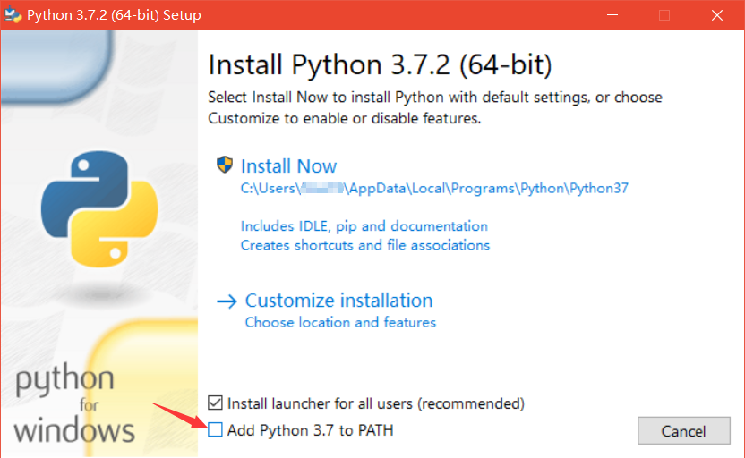<br><br>
  + 勾选"Add Python 3.7 to PATH"选项后单击"Customize installation"选项。
    <br><br>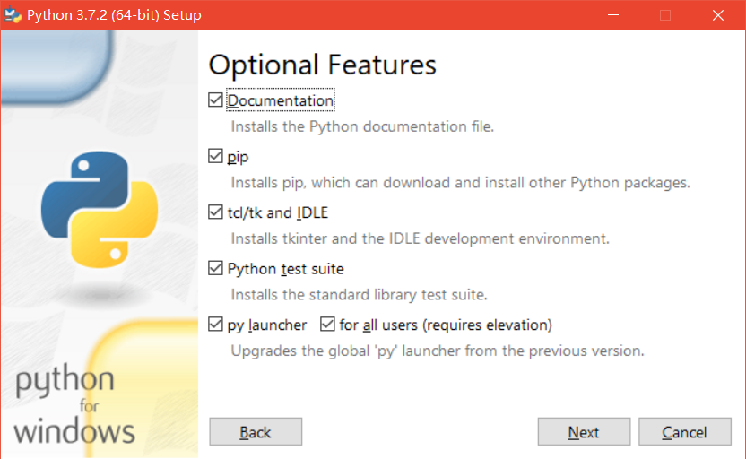<br><br>
  + 这里勾选所有选项。其中，
    * 🏷"Documentation" 表示安装Python的帮助文档
    * 🏷"pip" 表示安装Python的第三方包管理工具
    * 🏷"tcl/tk and IDLE" 表示安装Python的集成开发环境
    * 🏷"Python test suite" 表示安装Python的标准测试套件
    * 🏷"py launcher"和"for all users(requirfes elevation)" 表示允许版本更新
    
    👀勾选完所有选项后，单击"Next"
  + 保持默认勾选状态，单击"Browse"按钮，选择安装路径，然后点击"Install"开始安装。
    <br><br><br><br>

- **配置环境变量：** 在命令提示框中(cmd):输入`path=%path%;C:\Python`
  > **注意:** `C:\Python` 是Python的安装路径
  
  🚩[为什么要配置环境变量？](#answer)
  <a name="ansewer"></a>
  + 当安装完成Python后，你只能在你的安装目录下（含`Python.exe`可执行文件）来执行Python.exe或在当前路径下的CMD里输入`Python`来执行Python程序。
  + 当在电脑其他路径下的CMD中执行Python，会出现提示"<a href="https://blog.csdn.net/qq_42689684/article/details/82423727" target="_blank">不是内部或外部命令，也不是可运行的程序或批处理文件。</a>"
  + 如何在电脑全局中使用Python，就是我们为何要配置环境变量的原因。
  + 下面介绍一种更常用的配置环境变量的方法：
    * 第一步：鼠标右键"此电脑"，选择"属性"
      <br><br><br><br>
    * 第二步：选择窗口右边"高级系统设置"
      <br><br>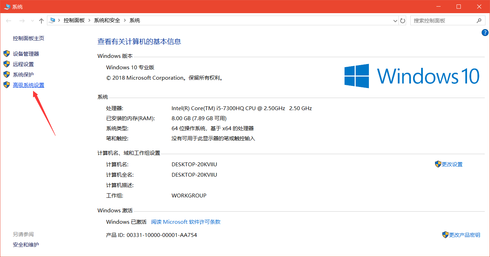<br><br>
    * 第三步：选择"环境变量"
      <br><br>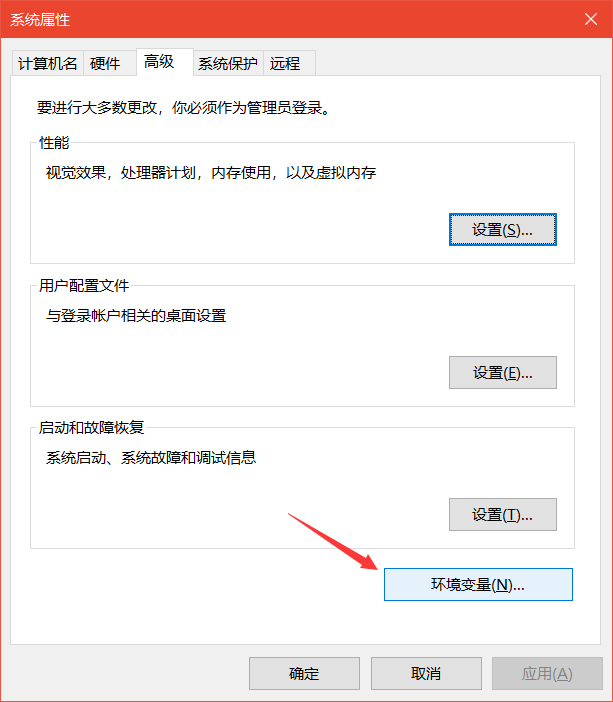<br><br>
    * 第四步：在系统变量里，双击"Path"以编辑环境变量
      <br><br><br><br>
    * 第五步：点击右边"新建"，输入Python安装路径，完成环境变量配置。
      <br><br><br><br>
  + 在任意路径处打开CMD窗口，输入`Python`，测试Python是否可以正常运行，输入`exit()`退出运行。
    <br><br><br><br>

---

[返回目录⬆](#快捷目录)

<a name="2"></a>
## 2. 编译器选择
&emsp;&emsp;Python的实际开发中最常用的是<a href="https://baike.baidu.com/item/PyCharm/8143824?fr=aladdin" target="_blank">PyCharm</a>这款编译器。它带有一整套可以帮助用户在使用Python语言开发时提高其效率的工具，比如调试、语法高亮、Project管理、代码跳转、智能提示、自动完成、单元测试、版本控制。此外，该IDE提供了一些高级功能，以用于支持<a href="https://baike.baidu.com/item/django/61531?fr=aladdin" target="_blank">Django</a>框架下的专业Web开发。
> 以上关于PyCharm的介绍摘自[百度百科](https://baike.baidu.com/)

&emsp;&emsp;但是在当前学习阶段我比较推荐的是<a href="https://baike.baidu.com/item/visual&ensp;studio&ensp;code/17514281" target="_blank">Visual Studio Code</a>（以下简称VS code）这款微软的跨平台编译器。因为轻便，这意味着你打开无需过多等待即能用。而且插件安装方便，对于<a href="https://baike.baidu.com/item/Sublime&ensp;Text/6284835?fr=aladdin" target="_blank">Sublime Text</a>这种轻便好用，语法高亮的文本编辑器来说，插件安装可以说是傻瓜式的（用过Sublime Text这种编辑器的才能懂它的插件安装的苦）。

ok，我只介绍这两款软件，下面我会分别给出它们的详细安装教程，以及一些Python的相关配置。

---

+ [PyCharm下载安装教程](#pycharm-install)
+ [VS code下载安装教程](#vscode-install)

---

<div align="center">
  <h3><a name="pycharm-install"></a>⚙ PyCharm5.0.3 下载安装详细教程</h3>
</div>
<br>
1. [点击我开始下载 PyCharm5.0.3](https://github.com/fmw666/Python/raw/master/step1-Python-basis/files/pycharm5.0.3.zip)
1. 右击软件压缩包选择解压到pycharm5.0.3
  <br><br><br><br>
1. 在解压文件夹中找到pycharm-professional-5.0.3，右击打开
  <br><br><br><br>
1. 点击Next按钮
  <br><br><br><br>
1. 点击Browser按钮更改安装路径，建议安装到除C盘以外的磁盘，然后单击Next
  <br><br>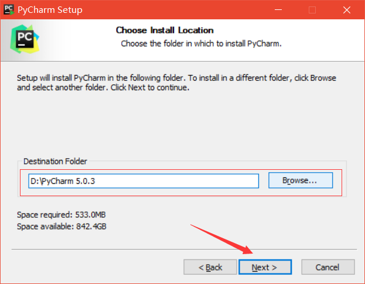<br><br>
1. 勾选Create Desktopshortcut（创建桌面快捷方式），然后点击Next
  <br><br><br><br>
1. 默认JetBrains，点击Install开始安装
  <br><br><br><br>
1. 等待安装完成
  <br><br>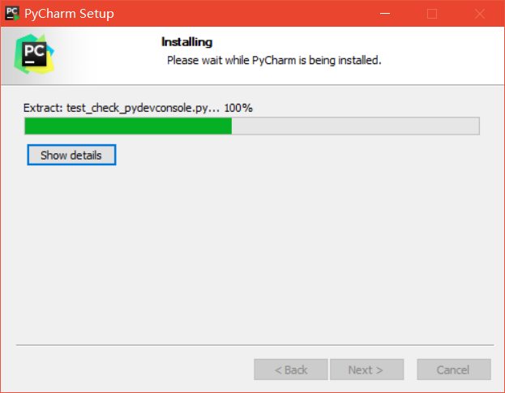<br><br>
1. 点击Finish结束（后续工作未完成，先不要勾选Run PyCharm）
  <br><br>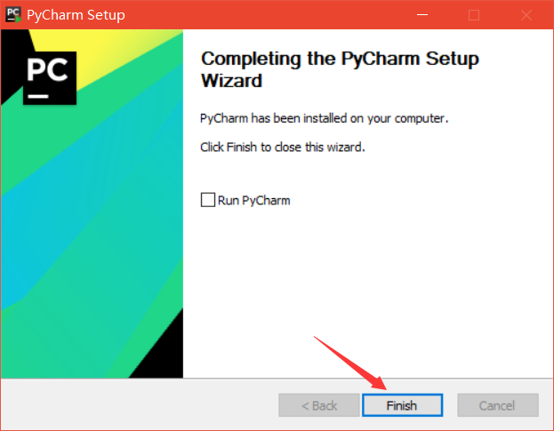<br><br>
1. 在解压文件夹中找到pycharm5.0.3汉化包，右击打开
  <br><br><br><br>
1. 选中里面所有的内容，右击复制
  <br><br><br><br>
1. 在你安装PyCharm5.0.3的文件夹中找到lib文件夹，右击打开
  <br><br><br><br>
1. 选择空白处，右击粘贴
  <br><br>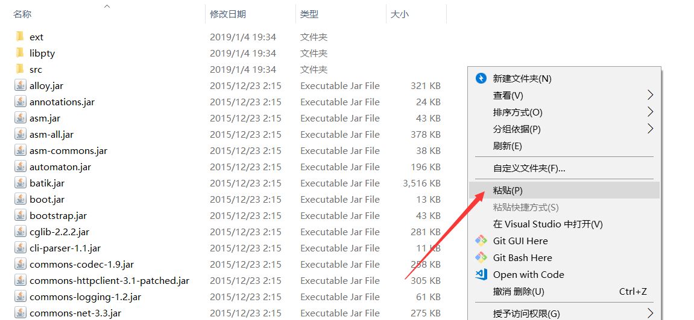<br><br>
1. 在桌面找到JetBrainsPyCharm5.0.3，右击打开
  <br><br>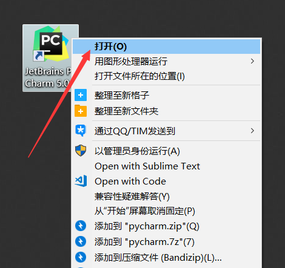<br><br>
1. 这一步中，勾选License server，在License server address：处填入`http：//idea.lanyus.com`,点击确定
  <br><br><br><br>
1. 安装完成，后面为配置wakatime插件步骤。在下方`Configure`中选择'插件'
  <br><br>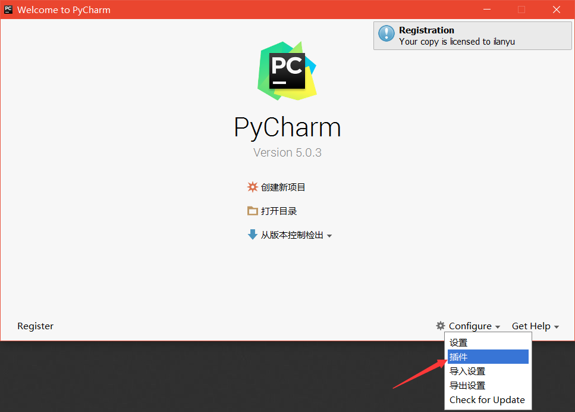<br><br>
1. 输入[wakatime](https://wakatime.com/)，点击安装
  <br><br><br><br>
1. 在页面中创建新项目，或者打开目录
  <br><br><br><br>
1. 在菜单栏中找到'工具'下方的`WakaTime Settings`
  <br><br>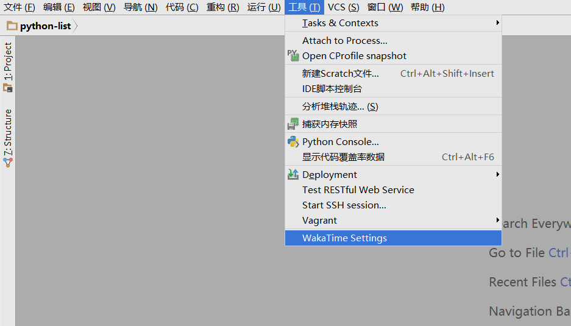<br><br>
1. 输入[wakatime](https://wakatime.com/)官网中你的API key，点击'Save'
  <br><br>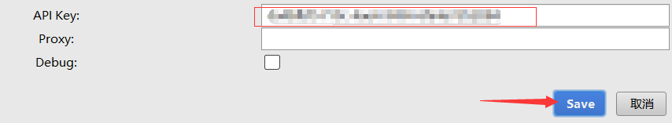<br><br>
1. 下面开始你的Python学习之旅吧~

---

<div align="center">
  <h3><a name="vscode-install"></a>⚙ VS code 下载安装详细教程</h3>
</div>
<br>
1. 在VS code官网首页中选择下载对应操作系统的安装包，注意：请选择'Stable'(稳定版)。官网戳这个链接：[https://code.visualstudio.com/](https://code.visualstudio.com/)
  <br><br>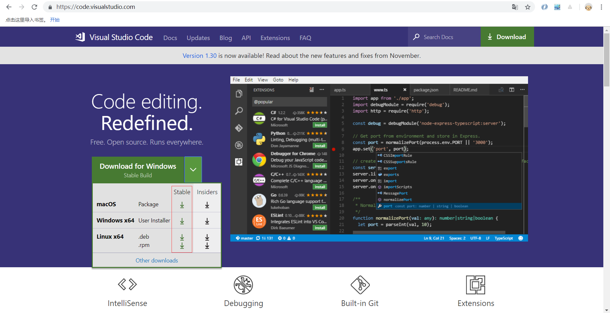<br><br>
1. 在解压文件夹中找到VSCodeUserSetup-x64-1.30.2.exe，右击打开
  <br><br>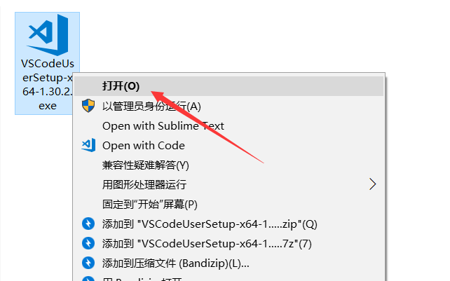<br><br>
1. 点击下一步
  <br><br><br><br>
1. 选择'我接受协议'，点击下一步
  <br><br>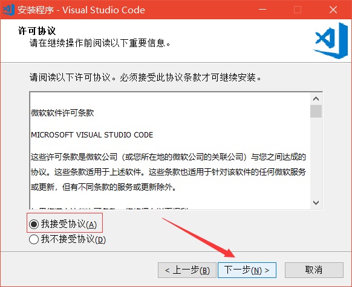<br><br>
1. 点击'游览'更改安装路径，建议安装到除C盘以外的磁盘，然后点击下一步
  <br><br><br><br>
1. 这里选择默认的即可，点击下一步
  <br><br><br><br>
1. 这里建议全选，点击下一步
  <br><br><br><br>
1. 确定无误后点击'安装'
  <br><br>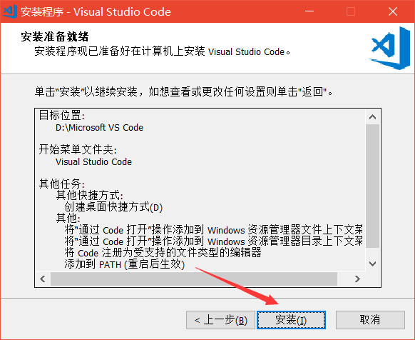<br><br>

---

[返回目录⬆](#快捷目录)

<a name="3"></a>
## 3. 写出你的第一个Python程序
&emsp;&emsp;首先，我想说，从这一节到最后所有关于Python的基础我都不会着重去讲。打个比方，关于print这个函数就有三个可选参数。如果诸如print函数，其它的函数或者对象方法我也一并全部抛出它们的所有知识点，那么你一定消化不了。或许你是强人，天赋异禀，但相较于平白直抒的抛出知识，我更喜欢寓教于乐的方式。所以一些扩展的语法和知识点我会在<a href="../step2-Pygame" target="_blank">第二部分——Python 游戏编程</a>中去讲述。我觉得学完一个知识点，你能知道它有什么用，为什么会用它，用它能做什么，并且你能实质性的做出什么来，是对你学习记忆最重要的。

这里我选用的编译器是[VS code](#vscode-install)（后面我都会选择用VS code来学习Python）

🐾下面来看VS code来编写和执行Python的过程。
+ 在要存放Python代码的文件夹中右击空白部分，选择"Open with Code"
<br><br>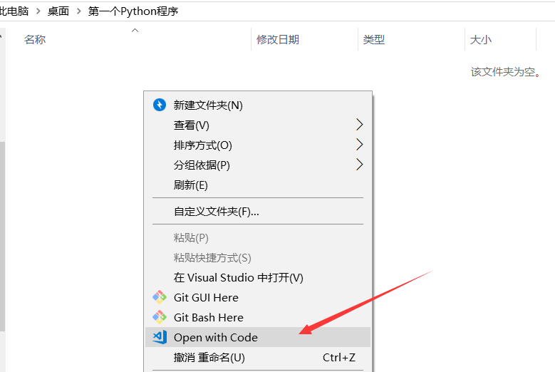<br><br>
+ 打开VS code后在左边你的文件夹下，选择"新建文件"，然后输入Python文件名（注意添加'.py'后缀）
<br><br><br><br>
+ 在建好的Python文件中输入<code>print('Hello World!')</code>，并按下`ctrl + s`保存文件
<br><br>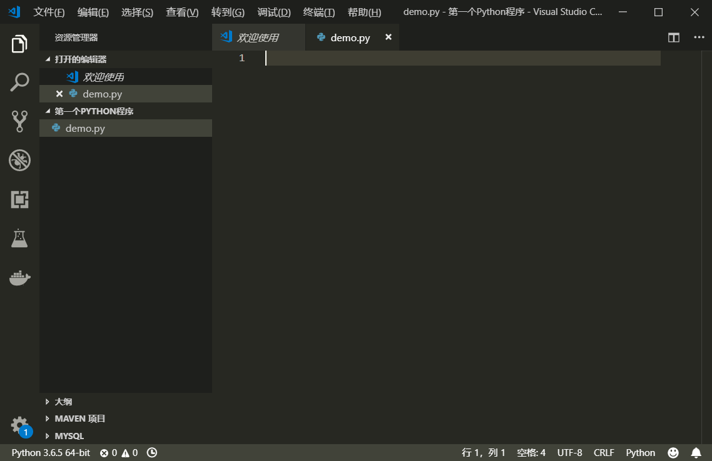<br><br>
+ 在文件内鼠标右击，选择"在终端中运行 Python 文件"
<br><br><br><br>
+ 在下方终端中，能看到Python程序执行后的结果
<br><br><br><br>

---

[返回目录⬆](#快捷目录)

<a name="4"></a>
## 4. Python基本操作
4.1. [Python注释](#4.1)<br>
4.2. [Python 的行与缩进](#4.2)<br>
4.3. [多行语句](#4.3)<br>
4.4. [Python 输入与输出](#4.4)<br>
4.5. [Python 变量](#4.5)<br>

---

<a name="4.1"></a>
<div align="center">
  <h3><a href="#4.1">4.1</a> Python注释</h3>
</div>
<br>

  &emsp;&emsp;注释的目的是让人能轻松阅读每一行代码的意义，同时也为程序员后期代码维护提供了方便。在Python中，一共有两种代码注释，一种是[单行注释](#4.1)，另一种是[多行注释](#4.1)
  
  *单行注释以`#`号开头：*
  ```python
  # 第一个注释
  print('Hello World') # 第二个注释
  ```
  *多行注释用两个`'''`包含起来:*
  ```python
  '''
  第一行注释
  第二行注释
  '''
  print('Hello World') # '''这样不能注释''' 
  '''这样也能注释'''
  ```
  
  ---
  
<a name="4.2"></a>
<div align="center">
  <h3><a href="#4.2">4.2</a> Python 的行与缩进</h3>
</div>
<br>

  &emsp;&emsp;Python 最具特色的就是使用缩进来表示代码块，即不需要使用大括号。缩进的空格数是可变的，但是同一个代码块的语句必须包含相同的缩进空格数，缩进不一致会导致代码运行错误。
  *正确示例：*
  ```python
  # 同样缩进四个空格
  if True:
      print('True')
      print('Yes')
  ```
  *错误示例：*
  ```python
  # 缩进四个空格与三个空格，运行会报错
  if True:
      print('True')
     print('Yes')
  ```
  *注意，下面这样的代码由于在不同代码块，所以**不会报错** ,但是我们绝不提倡*
  ```python
  if True:
      print('True')
  else:
     print('False')
  ```
  
  ---
  
<a name="4.3"></a>
<div align="center">
  <h3><a href="#4.3">4.3</a> 多行语句</h3>
</div>
<br>
  
  &emsp;&emsp;Python 通常是一行写完一条语句，但语句很长的话，可以通过反斜杠'\\'来实现多行语句。
  ```python
  sentence = "让我们以Python为舟，驶向全栈。这一节讲得是Python基础中的\
  多行语句，我们像这样就实现了写一条长句子的麻烦！"
  print(sentence)
  ```
  > 输出结果为："让我们以Python为舟，驶向全栈。这一节讲得是Python基础中的多行语句，我们像这样就实现了写一条长句子的麻烦！"
  
  &emsp;&emsp;这里有第二种方法，一般来说适合一段长文本的赋值，比如下面这个例子。
  ```python
  html = """
  <html>
      <head>
          <title>网页标题</title>
      </head>
      <body>
          <div class="container">
              <div class="list">
                  <ul>
                      <li><a herf="#">列表1</a></li>
                      <li><a herf="#">列表2</a></li>
                  </ul>
              </div>
          </div>
      <body>
  </html>
  """
  ```
  

  ---

<a name="4.4"></a>
<div align="center">
  <h3><a href="#4.4">4.4</a> Python 输入与输出</h3>
</div>
<br>

  - ***Python 中文编码***
  
    如果在运行[Python](#4.4)程序中，出现以下错误提示：
    ```python
    SyntaxError: Non-ASCII character '\xe4' in file test.py on line 2, but no encoding declared; see http://www.python.org/peps/pep-0263.html for details
    ```
    则未指定编码，需要在文件开头添加`#coding=utf-8`

    > 对于[VS code](#vscode-install)，在界面右下角中选择编码[UTF-8](#no-jump)
  
    ---
  
  <a name="print"></a>
  - ***Python 输出***
  
    ```python
    >>>print('hello,world')
    ```
    [print()](#print)函数可以接受多个字符串（字符串用一对`''`或者`""`表示），用逗号`,`或者加号`+`隔开，不过逗号在输出中相当于空格，加号则直接连接：
    ```python
    >>>print('hello','world')
    hello world
    >>>print('hello'+'world')
    helloworld
    ```
    [print()](#print)函数可以用于打印常数，或作计算
    ```python
    >>>print(100)
    100
    >>>print(1 + 1.1)
    2.1
    ```
  
    ---
  
  <a name="input"></a>
  - ***Python 输入***
  
    ```python
    >>>name = input()
    fmw
    ```
    当出现[input()](#input)函数以后，命令行会等待用户输入一串字符，此时用户输入的字符串将保留在[name](#no-jump)变量中。
    ```python
    >>>name
    'fmw'
    >>>print(name)
    fmw
    ```
    当然，为了增加用户交互体验，我们可以
    ```python
    >>>name = input('Please input your name:')
    Please input your name:fmw
    >>>print('hello',name)
    hello fmw
    ```
    
    ---
    
<a name="4.5"></a>
<div align="center">
  <h3><a href="#4.5">4.5</a> Python 变量</h3>
</div>
<br>

  - ***变量赋值***
  
    Python中的赋值很简单，不需要先指明变量的数据类型。看下面代码：
    ```python
    a = 6
    print(a)
    ```
    > **注意：** Python的变量无需提前声明，赋值的同时也就声明了变量。
  
    ---
  
  - ***变量命名***
  
    Python中自带关键字（保留字），变量名不能与之相同。变量名由`字母`、`下划线'_'`和`数字`组成，且不能以数字开头。在Python标准库中提供了一个 [keyword](#no-jump)模块，可以查阅当前版本的所有关键字，方法如下：
    ```python
    import keyword
    print(keyword.kwlist)
    ```
    

---

[返回目录⬆](#快捷目录)

<a name="5"></a>
## 5. Python数据类型

[返回目录⬆](#快捷目录)

<a name="2"></a>
## 2. 编译器选择

[返回目录⬆](#快捷目录)

<a name="2"></a>
## 2. 编译器选择

[返回目录⬆](#快捷目录)

---

<br><br><br>
<div align="right">
    <a href="../step2-Pygame">Python游戏之旅——Pygame➡</a>
</div>
