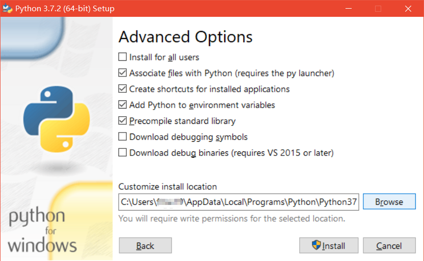
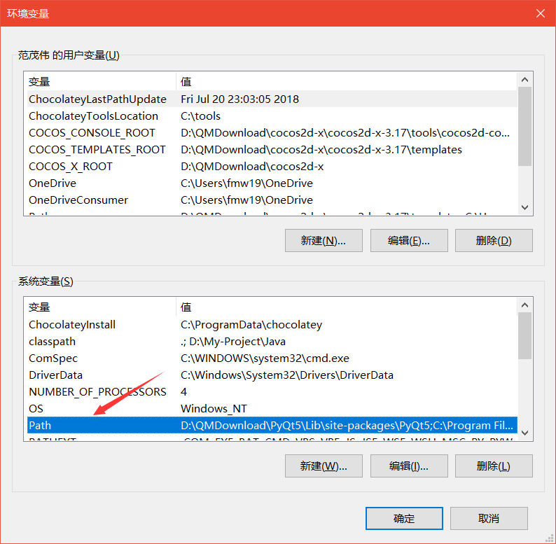
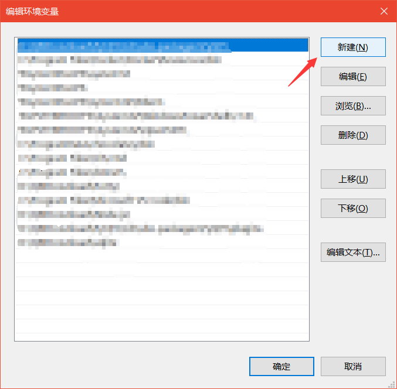

# 💬Python 基础
&emsp;&emsp;欢迎来到Python学习的第一部分—— Python基础学习。要知道，任何一门语言没有前期基础的建立，后期的学习都是不牢固的，所以基础这一部分就显得尤为重要。但是呢，为保证我们快速进入到后面学习中，在基础这一部分，语法我不会讲得过于深奥，重要的语法扩展我们留到后面的学习中遇到再展开学习。

---

#### *📑快捷目录：* 
[1. 安装Python环境](#1)

[2. 编译器选择](#2)

[3. 写出你的第一个Python程序](#3)

[4. Python数据类型](#4)

---

### 1. 安装Python环境
🐍Python官网下载链接：[https://www.python.org/downloads/](https://www.python.org/downloads/)

*这里以 Windows环境下为例：*

- **Python 版本：** 3.7.2

- **下载链接地址：** [点击此处开始下载](https://www.python.org/ftp/python/3.7.2/python-3.7.2-amd64.exe)
  + 下载完成后双击运行安装程序，如图：
        
  + 勾选"Add Python 3.7 to PATH"选项后单击"Customize installation"选项。
        
  + 这里勾选所有选项。其中，
    * 🏷"Documentation" 表示安装Python的帮助文档
    * 🏷"pip" 表示安装Python的第三方包管理工具
    * 🏷"tcl/tk and IDLE" 表示安装Python的集成开发环境
    * 🏷"Python test suite" 表示安装Python的标准测试套件
    * 🏷"py launcher"和"for all users(requirfes elevation)" 表示允许版本更新
    
    👀勾选完所有选项后，单击"Next"
  + 保持默认勾选状态，单击"Browse"按钮，选择安装路径，然后点击"Install"开始安装。
        

- **配置环境变量：** 在命令提示框中(cmd):输入`path=%path%;C:\Python`
  > **注意:** `C:\Python` 是Python的安装路径
  
  🚩[为什么要配置环境变量？](#answer)
  
  + 当安装完成Python后，你只能在你的安装目录下（含`Python.exe`可执行文件）来执行Python.exe或在当前路径下的CMD里输入`Python`来执行Python程序。
  + 当在电脑其他路径下的CMD中执行Python，会出现提示"[不是内部或外部命令，也不是可运行的程序或批处理文件。](https://blog.csdn.net/qq_42689684/article/details/82423727)"
  + 如何在电脑全局中使用Python，就是我们为何要配置环境变量的原因。
  + 下面介绍一种更常用的配置环境变量的方法：
    * 第一步：鼠标右键"此电脑"，选择"属性"
          
    * 第二步：选择窗口右边"高级系统设置"
          
    * 第三步：选择"环境变量"
          
    * 第四步：在系统变量里，双击"Path"以编辑环境变量
          
    * 第五步：点击右边"新建"，输入Python安装路径，完成环境变量配置。
          
  + 在任意路径处打开CMD窗口，输入`Python`，测试Python是否可以正常运行，输入`exit()`退出运行。
        

---

[返回目录⬆](#快捷目录)

### 2. 编译器选择
&emsp;&emsp;Python的实际开发中最常用的是[PyCharm](https://baike.baidu.com/item/PyCharm/8143824?fr=aladdin)这款编译器。它带有一整套可以帮助用户在使用Python语言开发时提高其效率的工具，比如调试、语法高亮、Project管理、代码跳转、智能提示、自动完成、单元测试、版本控制。此外，该IDE提供了一些高级功能，以用于支持[Django](https://baike.baidu.com/item/django/61531?fr=aladdin)框架下的专业Web开发。
> 以上关于PyCharm的介绍摘自[百度百科](https://baike.baidu.com/)

&emsp;&emsp;但是在当前学习阶段我比较推荐的是[Visual Studio Code](https://baike.baidu.com/item/visual studio code/17514281)（以下简称VS code）这款微软的跨平台编译器。因为轻便，这意味着你打开无需过多等待即能用。而且插件安装方便，对于[Sublime Text](https://baike.baidu.com/item/Sublime Text/6284835?fr=aladdin)这种轻便好用，语法高亮的文本编辑器来说，插件安装可以说是傻瓜式的（用过Sublime Text这种编辑器的才能懂它的插件安装的苦）。

ok，我只介绍这两款软件，下面我会分别给出它们的详细安装教程，以及一些Python的相关配置。
+ [PyCharm下载安装教程](#pycharm-install)
+ [VS code下载安装教程](#vscode-install)

---

[返回目录⬆](#快捷目录)

### 3. 写出你的第一个Python程序
&emsp;&emsp;首先，我想说，从这一节到最后所有关于Python的基础我都不会着重去讲。打个比方，关于print这个函数就有三个可选参数。如果诸如print函数，其它的函数或者对象方法我也一并全部抛出它们的所有知识点，那么你一定消化不了。或许你是强人，天赋异禀，但相较于平白直抒的抛出知识，我更喜欢寓教于乐的方式。所以一些扩展的语法和知识点我会在[第二部分——Python 游戏编程](../step2-Pygame)中去讲述。我觉得学完一个知识点，你能知道它有什么用，为什么会用它，用它能做什么，并且你能实质性的做出什么来，是对你学习记忆最重要的。

---

[返回目录⬆](#快捷目录)

### 4. Python数据类型

[返回目录⬆](#快捷目录)

### 2. 编译器选择

[返回目录⬆](#快捷目录)

### 2. 编译器选择

[返回目录⬆](#快捷目录)

### 2. 编译器选择

[返回目录⬆](#快捷目录)

### 2. 编译器选择

[返回目录⬆](#快捷目录)

           

## ⚡Python简介与安装   
+ **Python 是一种解释型语言：** 这意味着开发过程中没有了编译这个环节。类似于[PHP]()和[Perl]()语言。
+ **Python 是交互式语言：** 这意味着，您可以在一个[Python]()提示符，直接互动执行写你的程序。
+ **Python 是面向对象语言:** 这意味着[Python]()支持面向对象的风格或代码封装在对象的编程技术。
+ **Python 是初学者的语言：** [Python]() 对初级程序员而言，是一种伟大的语言，它支持广泛的应用程序开发，从简单的文字处理到 [WWW]() 浏览器再到游戏。
---
### Python 特点
1. **易于学习：** [Python]()有相对较少的关键字，结构简单，和一个明确定义的语法，学习起来更加简单。
1. **易于阅读：** [Python]()代码定义的更清晰。
1. **易于维护：** [Python]()的成功在于它的源代码是相当容易维护的。
1. **一个广泛的标准库：** [Python]()的最大的优势之一是丰富的库，跨平台的，在UNIX，Windows和Macintosh兼容很好。
1. **互动模式：** 互动模式的支持，您可以从终端输入执行代码并获得结果的语言，互动的测试和调试代码片断。
1. **可移植：** 基于其开放源代码的特性，[Python]()已经被移植（也就是使其工作）到许多平台。
1. **可扩展：** 如果你需要一段运行很快的关键代码，或者是想要编写一些不愿开放的算法，你可以使用C或C++完成那部分程序，然后从你的[Python]()程序中调用。
1. **数据库：** [Python]()提供所有主要的商业数据库的接口。
1. **GUI编程：** [Python]()支持GUI可以创建和移植到许多系统调用。
1. **可嵌入:** 你可以将[Python]()嵌入到C/C++程序，让你的程序的用户获得"脚本化"的能力。
---
### Python下载
> [点击我下载python3.7.1安装包](https://www.python.org/ftp/python/3.7.1/python-3.7.1-webinstall.exe)
---
### 在 Windows 设置环境变量
在命令提示框中(cmd):输入
`path=%path%;C:\Python`
> **注意:** `C:\Python` 是[Python]()的安装目录
---
### 在 [Visual Studio Code](https://code.visualstudio.com/) 中运行Python
**第一步：** 打开[VS code]()，在左边"扩展"一栏搜索`Python`，点击安装。

**第二步：** 新建`.py`文件，写一段[Python]()代码，鼠标右键点击代码框，点击在终端运行。

