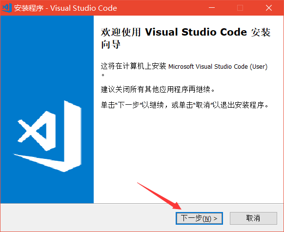
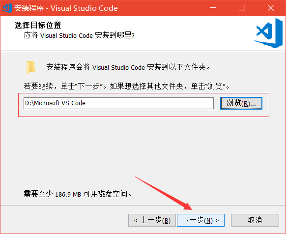
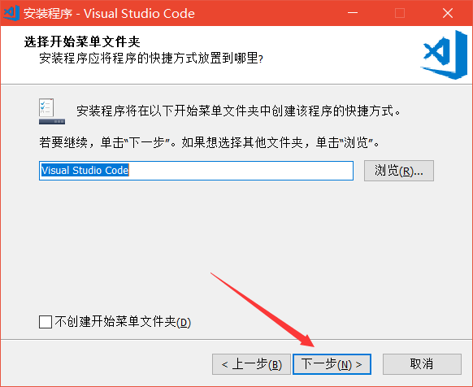
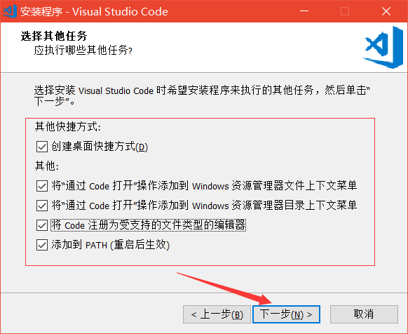

  <h3>⚙ VS code 下载安装详细教程</h3>

 

1. 在VS code官网首页中选择下载对应操作系统的安装包，注意：请选择'Stable'(稳定版)。官网戳这个链接：[https://code.visualstudio.com](https://code.visualstudio.com/)
      
1. 在解压文件夹中找到VSCodeUserSetup-x64-1.30.2.exe，右击打开
      
1. 点击下一步
      
1. 选择'我接受协议'，点击下一步
      
1. 点击'游览'更改安装路径，建议安装到除C盘以外的磁盘，然后点击下一步
      
1. 这里选择默认的即可，点击下一步
      
1. 这里建议全选，点击下一步
      
1. 确定无误后点击'安装'
      
