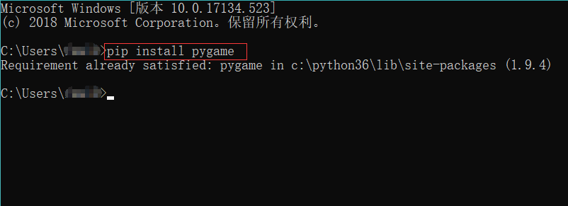
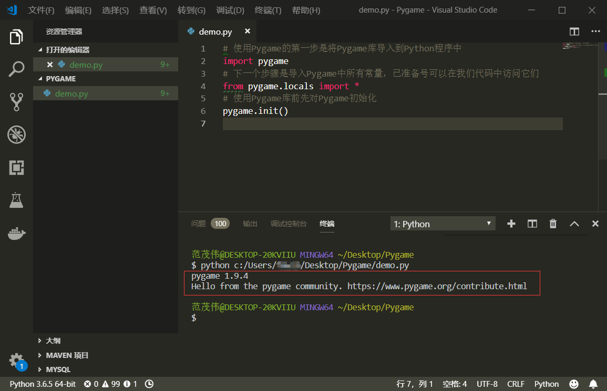
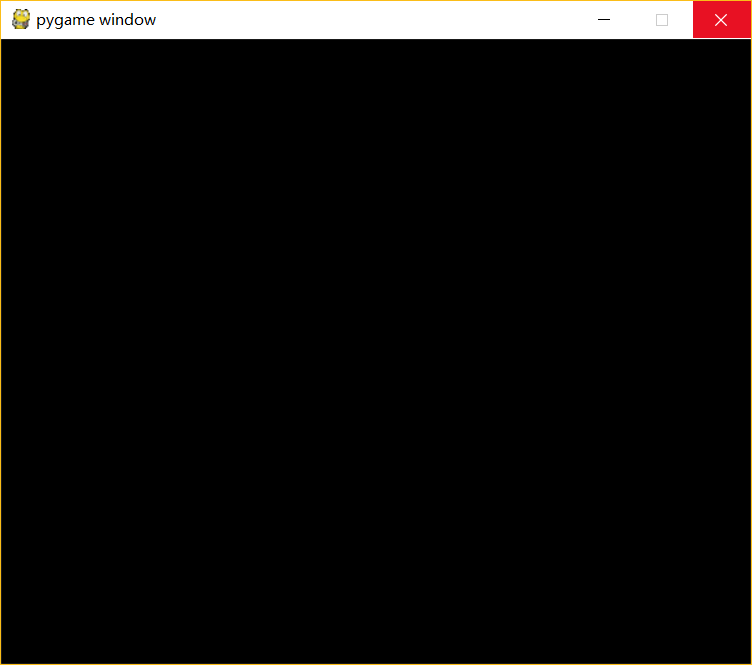

# 💬《Python游戏之旅——Pygame》  
&emsp;&emsp;我始终觉得游戏是学习编程语言最有效的一种方式，每个人都会想有一款属于自己的游戏。当你学习到一个知识点，你能马上用来当作你游戏开发的一项工具，这无疑是学习的最好的方式。类可以创建一个个对象、循环可以控制游戏进程、判断语句可以控制游戏逻辑、文件可以保存游戏进度……

---

#### *📑快捷目录：*
[1. 初识 Pygame](#初识-pygame)

[2. 打印文本](#打印文本)

[3. ##](#3)

---

## 1. 初识 Pygame
&emsp;&emsp;Pygame这个游戏库，能方便我们绘制图形、获取用户输入、执行动画以及使用定时器让游戏按照稳定的帧速率运行。所以，Pygame不仅提供了针对图形和位图的绘制函数，还提供了用于获取用户输入、处理音频播放和监控鼠标和键盘的服务。

+ **Pygame 的安装：**

  🛠通过Python的第三方包管理工具pip，在终端中执行：
  ```python
  pip install pygame
  ```
  
  
  > 这里我已经安装过这个包，所以出现了如上提醒。
+ **Pygame 的使用：**

  ```python
  # 使用Pygame的第一步是将Pygame库导入到Python程序中
  import pygame
  # 下一个步骤是导入Pygame中所有常量，已准备号可以在我们代码中访问它们
  from pygame.locals import *
  # 使用Pygame库前先对Pygame初始化
  pygame.init()
  ```
  *当执行后上面三条指令后，会出现下面终端中显示的结果：*
  <br><br><br><br>
  [但是怎么创建一个窗口呢？](#answer)
  
  <a name="answer"></a>
  我们定义一个窗口屏幕的变量`screen`，然后用`pygame.display.set_mode((WIDTH,HEIGHT))`来初始化它
  ```python
  import pygame
  from pygame.locals import *
  pygame.init()
  # 设置屏幕窗口大小为600×500，宽为600，高为500
  screen = pygame.display.set_mode((600,500))
  ```
  🐌执行一下看出现了什么结果？屏幕一闪而过。而要解决这个问题我们只需利用一个while循环。<br>
  不仅如此，我们还希望在这个出现的窗口中，我们点击右上角的叉号能关闭程序，所以，我们还需要添加事件处理。
  ```python
  import pygame
  from pygame.locals import *
  pygame.init()
  screen = pygame.display.set_mode((600,500))
  while True:
      # 读取事件
      for event in pygame.event.get():
          # 如果按下右上角叉号
          if event.type == QUIT:
              # 程序退出
              exit()
  ```
  *运行后的结果：*
  <br><br><br><br>
  
---

[返回目录⬆](#快捷目录)

## 2. 打印文本
&emsp;&emsp;Pygame支持使用`Pygame.font`将文本输出到图形窗口。要绘制文本，我们必须先创建一个字体对象：
    ```python
    myfont = pygame.font.Font(None,60)
    ```
    > 使用`None`是让pygame使用默认字体，`60`为字体大小

---

<br><br><br>
<div align="right">
    <a href="../step3-Algorithm">Python数据结构与算法➡</a>
</div>

