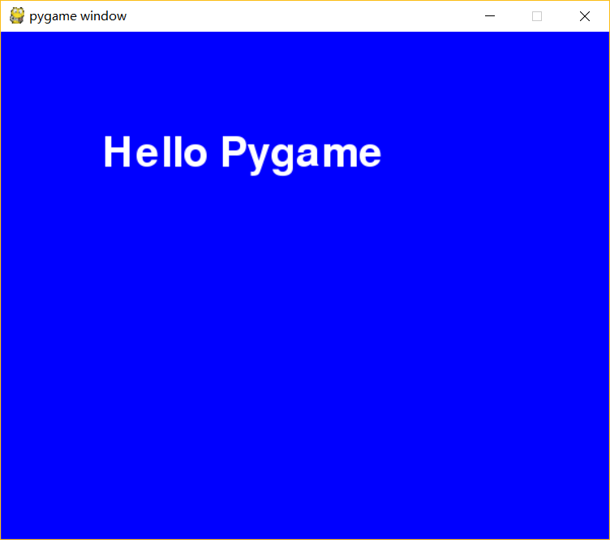
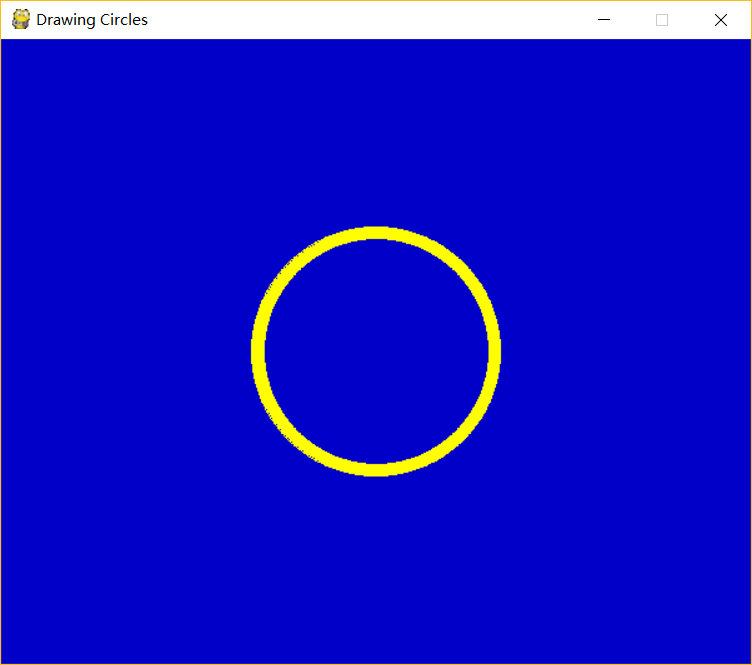
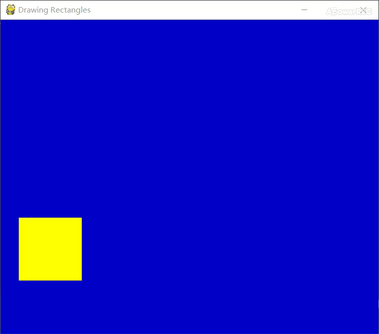
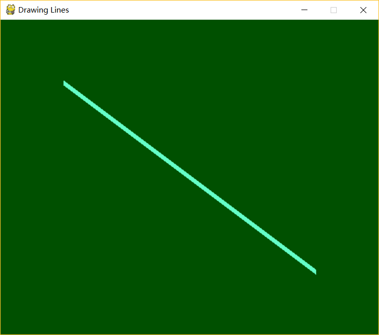
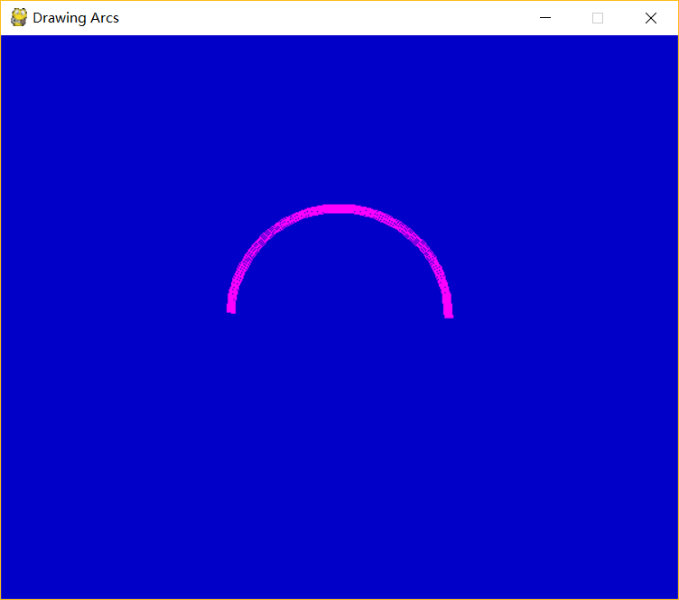

# 💬《Python游戏之旅——Pygame》  
我始终觉得游戏是学习编程语言最有效的一种方式，每个人都会想有一款属于自己的游戏。当你学习到一个知识点，你能马上用来当作你游戏开发的一项工具，这无疑是学习的最好的方式。类可以创建一个个对象、循环可以控制游戏进程、判断语句可以控制游戏逻辑、文件可以保存游戏进度……

---

#### *📑快捷目录：*
[1. 初识 Pygame](#1-初识-pygame)

[2. 打印文本](#2-打印文本)

[3. 绘制图形](#3-绘制图形)

---

## 1. 初识 Pygame
  Pygame这个游戏库，能方便我们绘制图形、获取用户输入、执行动画以及使用定时器让游戏按照稳定的帧速率运行。所以，Pygame不仅提供了针对图形和位图的绘制函数，还提供了用于获取用户输入、处理音频播放和监控鼠标和键盘的服务。

+ **Pygame 的安装：**

  🛠通过Python的第三方包管理工具pip，在终端中执行：
  ```python
  pip install pygame
  ```
  
  
  > 这里我已经安装过这个包，所以出现了如上提醒。
+ **Pygame 的使用：**

  ```python
  # 使用Pygame的第一步是将Pygame库导入到Python程序中
  import pygame
  # 下一个步骤是导入Pygame中所有常量，已准备号可以在我们代码中访问它们
  from pygame.locals import *
  # 使用Pygame库前先对Pygame初始化
  pygame.init()
  ```
  *当执行后上面三条指令后，会出现下面终端中显示的结果：*
  <br><br><br><br>
  [但是怎么创建一个窗口呢？](#answer)
  
  <a name="answer"></a>
  我们定义一个窗口屏幕的变量`screen`，然后用`pygame.display.set_mode((WIDTH,HEIGHT))`来初始化它
  ```python
  import pygame
  from pygame.locals import *
  pygame.init()
  # 设置屏幕窗口大小为600×500，宽为600，高为500
  screen = pygame.display.set_mode((600,500))
  ```
  🐌执行一下看出现了什么结果？屏幕一闪而过。而要解决这个问题我们只需利用一个while循环。<br>
  不仅如此，我们还希望在这个出现的窗口中，我们点击右上角的叉号能关闭程序，所以，我们还需要添加事件处理。
  ```python
  import pygame
  from pygame.locals import *
  pygame.init()
  screen = pygame.display.set_mode((600,500))
  while True:
      # 读取事件
      for event in pygame.event.get():
          # 如果按下右上角叉号
          if event.type == QUIT:
              # 程序退出
              exit()
  ```
  *运行后的结果：*
  <br><br><br><br>
  
---

[返回目录⬆](#快捷目录)

## 2. 打印文本
+ **Pygame支持使用`Pygame.font`将文本输出到图形窗口。要绘制文本，我们必须先创建一个字体对象：**

  ```python
  myfont = pygame.font.Font(None,60)
  ```
  > 使用`None`是让pygame使用默认字体，`60`为字体大小。

+ **要说明的是，pygame中打印文本不是一个轻量型的进程，而是一个重量型的进程，所以文本不能快速地绘制到屏幕上，而是渲染到一个平面，然后再将其绘制到屏幕上。由于这是一个极其费时的过程，所以一般来说，建议首先在内存中创建文本平面（或图像），然后再将文本当作一个图像来绘制。**

  ```python
  myfont = pygame.font.Font(None,60)
  white = 255,255,255
  blue = 0,0,255
  textImage = myfont.render('Hello Pygame', True, white)
  ```
  > textImage对象是可以使用`screen.blit()`绘制的平面，我们的高难度的绘制函数，将会在所有的游戏和示例中广泛地使用。`my.font.render()`函数中，第一个参数为文本消息，第二个参数是抗锯齿字体（为了提高质量）的一个标志，第三个参数是颜色（RGB值）

+ **现在我们在之前写好的循环中加入屏幕绘制函数来显示我们的文本：**

  ```python
  screen.fill(blue)
  screen.blit(textImage, (100,100))
  pygame.display.update()
  ```

+ **完整代码如下：**

  ```python
  import pygame
  from pygame.locals import *

  pygame.init()
  screen = pygame.display.set_mode((600,500))

  myfont = pygame.font.Font(None,60)
  white = 255,255,255
  blue = 0,0,255
  textImage = myfont.render('Hello Pygame', True, white)
  while True:
      # 读取事件
      for event in pygame.event.get():
          # 如果按下右上角叉号
          if event.type == QUIT:
              # 程序退出
              exit()
      screen.fill(blue)
      screen.blit(textImage, (100,100))
      pygame.display.update()
  ```
  

---

[返回目录⬆](#快捷目录)

## 3. 绘制图形
&emsp;&emsp;我们可以使用`pygame.draw`来绘制众多不同的形状。
+ **绘制圆**
  
  *要绘制圆，我们使用`pygame.draw.circle(screen, color, position, radius, width)`，传递的参数为圆的大小、颜色和位置：*
  
  ```python
  import pygame,sys
  from pygame.locals import *
  
  pygame.init()
  screen = pygame.display.set_mode((600,500))
  pygame.display.set_caption("Drawing Circles")
  
  while True:
      for event in pygame.event.get():
          if event.type in (QUIT,KEYDOWN):
              sys.exit()

          screen.fill((0,0,200))

          #draw a circle
          color = 255,255,0
          position = 300,250
          radius = 100
          width = 10
          pygame.draw.circle(screen,color,position,radius,width)

          pygame.display.update()
  ```
  
  
+ **绘制矩形**

  *要绘制矩形，我们使用`pygame.draw.rect(screen, color, pos, with)`函数，这里程序中，我们去实现移动矩形，在while循环外我没用`pos_x`和`pos_y`来记录矩形的位置，并创建一对速度变量`vel_x`和`vel_y`：*
  
  ```python
  import pygame
  from pygame.locals import *

  pygame.init()
  screen = pygame.display.set_mode((600,500))
  pygame.display.set_caption("Drawing Rectangles")
  pos_x = 300
  pos_y = 250
  vel_x = 0.2
  vel_y = 0.1

  while True:
      for event in pygame.event.get():
          if event.type == QUIT:
              exit()

      screen.fill((0,0,200))

      #move the rectangle
      pos_x += vel_x
      pos_y += vel_y

      #keep rectangle on the screen
      if pos_x > 500 or pos_x < 0:
          vel_x = -vel_x
      if pos_y > 400 or pos_y < 0:
          vel_y = -vel_y

      #draw the rectangle
      color = 255,255,0
      width = 0 #solid fill
      pos = pos_x,pos_y,100,100
      pygame.draw.rect(screen,color,pos,width)

      pygame.display.update()
  ```
  
  
+ **绘制线条**

  *要绘制线条，我们使用`pygame.draw.line(screen, color, (start_x,start_y), (end_x,end_y), width)`函数：*
  
  ```python
  import pygame
  from pygame.locals import *

  pygame.init()
  screen = pygame.display.set_mode((600,500))
  pygame.display.set_caption("Drawing Lines")

  while True:
      for event in pygame.event.get():
          if event.type == QUIT:
              exit()

      screen.fill((0,80,0))

      #draw the line
      color = 100,255,200
      width = 8
      pygame.draw.line(screen,color,(100,100),(500,400),width)

      pygame.display.update()
  ```
  
  
+ **绘制弧形**

  *要绘制弧形，我们使用`pygame.draw.arc(screen,color,position,start_angle,end_angle,width)`函数，其中由于弧形是圆的一部分，所以我们得需要其他函数来表示额外的参数（比如角度）：*
  
  ```python
  import pygame
  from pygame.locals import *
  import math

  pygame.init()
  screen = pygame.display.set_mode((600, 500))
  pygame.display.set_caption("Drawing Arcs")

  while True:
      for event in pygame.event.get():
          if event.type == QUIT:
              exit()

      screen.fill((0, 0, 200))

      #draw the arc
      color = 255,0,255
      position = 200,150,200,200
      start_angle = math.radians(0)
      end_angle = math.radians(180)
      width = 8
      pygame.draw.arc(screen,color,position,start_angle,end_angle,width)

      pygame.display.update()
  ```
  
  
---

<br><br><br>
<div align="right">
    <a href="../step3-Algorithm">Python数据结构与算法➡</a>
</div>

