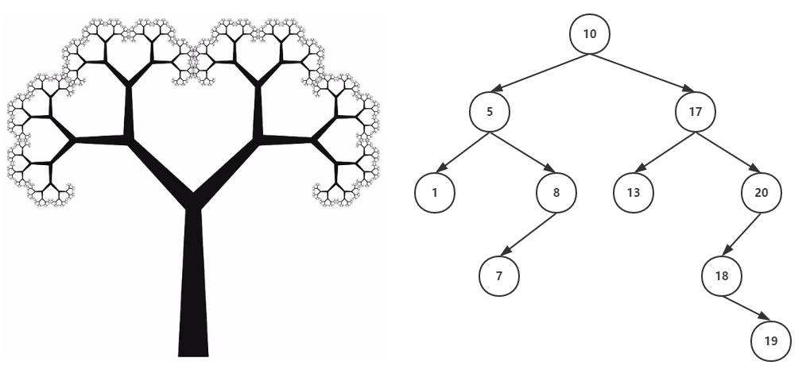

# 💬《Python 数据结构与算法》
&emsp;&emsp;我认为在计算机编程学习中，最为重要的就是数据结构与算法这门课程。这门课的学习会使你整个编程生涯终身受用，我这里可绝对不是夸大其词，在面试中，看似面试官问的是相关语言，其实问的是语言背后的数据结构，看似问的是数据结构，其实问的是背后实现的算法。需要注意的是，我们专门有一个 repo 是对数据结构和算法这两门课程的深度讲解，在那篇文档中，我主要是基于 C或C++ 。所以关于数据结构和算法的基础知识和深度讲解请转至上述 repo，链接请戳 [这里](https://github.com/fmw666/Data-Structure/)。本文主要基于 Python 实现大部分数据结构与算法。

---

    

#### *⭐ 本章作者呕心沥血推荐读物*

+ [《离散数学（第五版）》](https://www.baidu.com/link?url=4svn2zwEsw5PWP8ZJPr9WYONIA6nIvY5Ocoz_1Aa7VE6k4bjanu-_wmeI4RQAayZTdR_Mb7h8t-NVKhTixUvkshzzuMjtTVZc1adl8h0hnW&wd=&eqid=dd79a6f80008cecb000000035cdaaf08)- 清华大学出版社

+ [Python3.7 官方中文教程之数据结构](https://docs.python.org/zh-cn/3/tutorial/datastructures.html)

+ [《数据结构与算法:Python语言描述》](https://book.douban.com/subject/26702568/)

+ [《算法图解》](https://book.douban.com/subject/26979890/)- 人民邮电出版社

## 第一部分

[asd](#)
